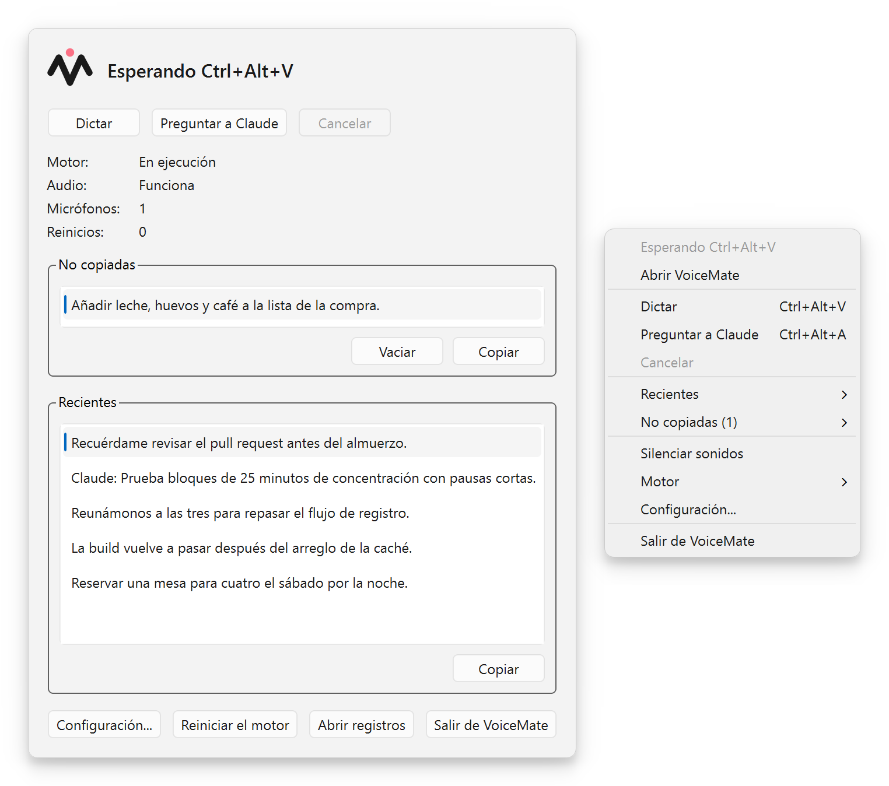
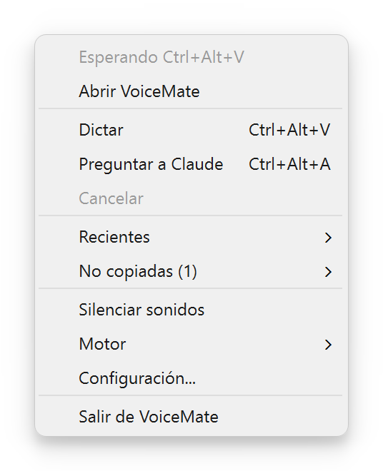
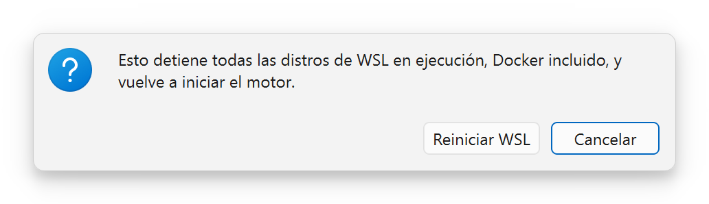
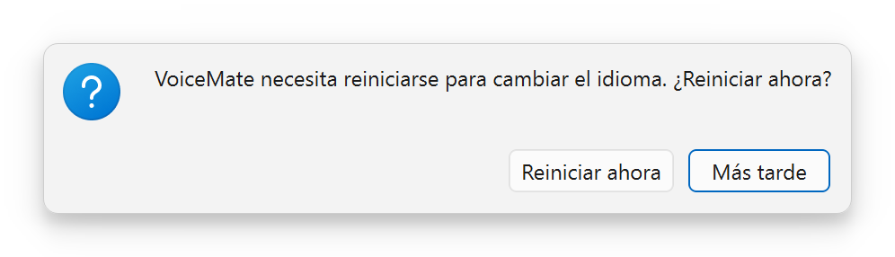
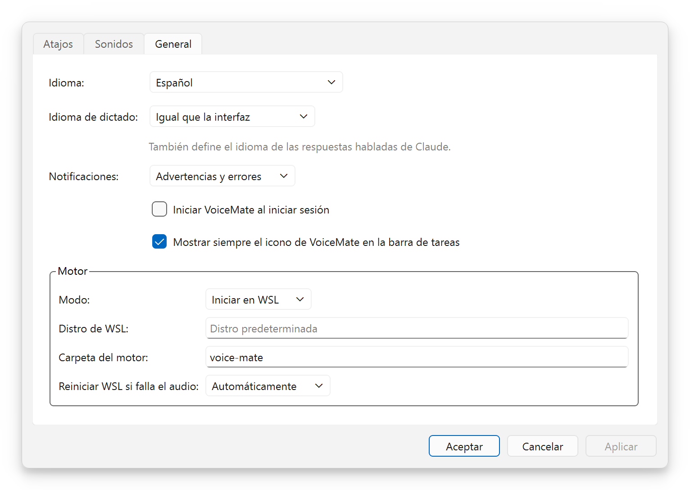
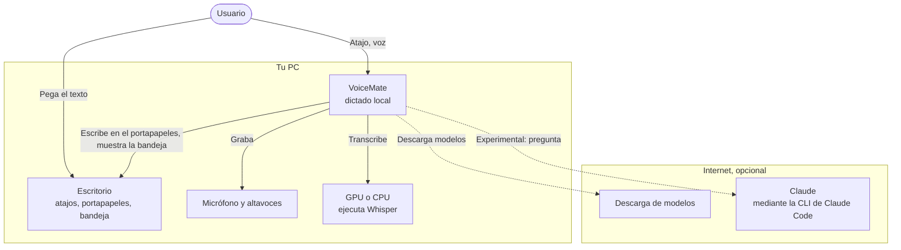
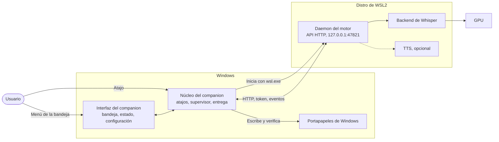
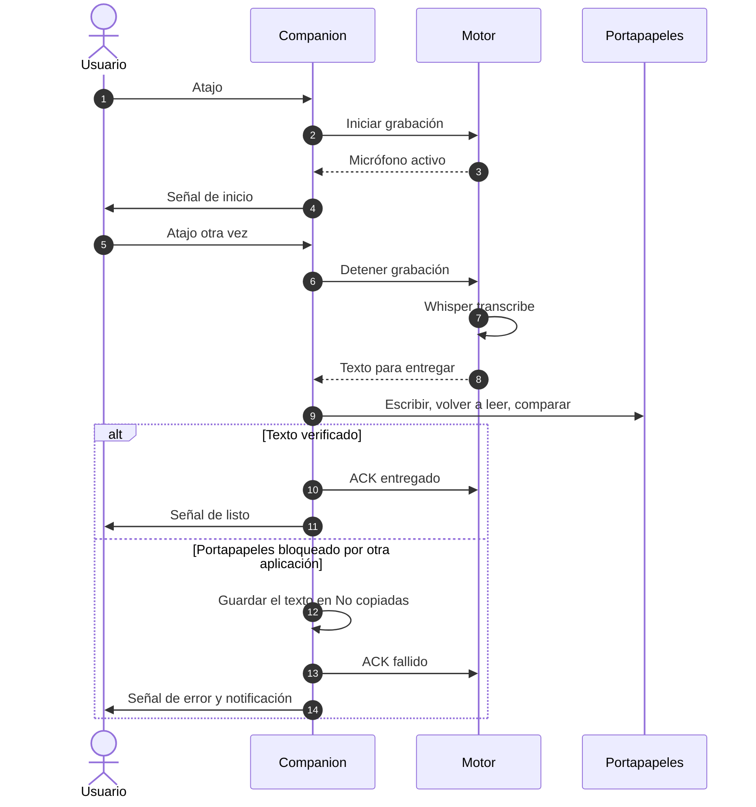
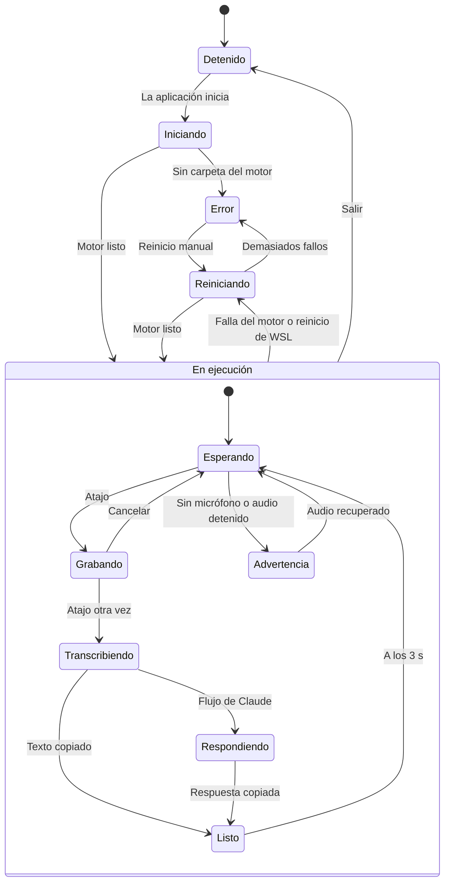
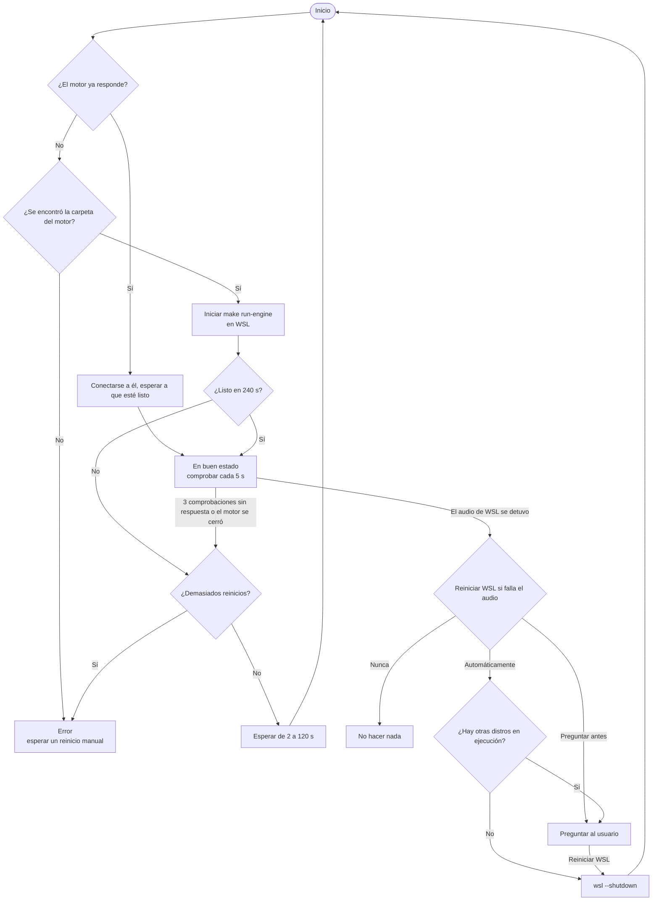

[English](README.md) | [Português](README.pt-BR.md) | **Español** | [Русский](README.ru.md) | [简体中文](README.zh-CN.md)

<div align="center">

<picture>
  <source media="(prefers-color-scheme: dark)" srcset="docs/assets/brand/banner-dark.png">
  <source media="(prefers-color-scheme: light)" srcset="docs/assets/brand/banner-light.png">
  
</picture>

**Presiona un atajo, habla, pega. Dictado por voz local al portapapeles, con Whisper funcionando en tu propia computadora.**

[](https://github.com/nano-br/voice-mate/actions/workflows/ci.yml)
[](https://github.com/nano-br/voice-mate/releases/latest)
[](LICENSE)
[](pyproject.toml)
[-0078D6?style=flat)](#plataformas-y-gpus)
[](#idiomas)

[Descargar](https://github.com/nano-br/voice-mate/releases/latest) · [Inicio rápido](#inicio-rápido) · [Documentación](#documentación) · [Changelog](CHANGELOG.md)



</div>

## Por qué VoiceMate

Construí VoiceMate porque creo en algo sencillo: cuanto más rápido y fácil es expresarle una idea a una IA, y cuanto más detalle le das, mejor es el resultado. Hablar es mucho más rápido que escribir. Cuando piensas en voz alta, explicas una idea como se la explicarías a otra persona, con mucho más contexto del que escribirías jamás.

VoiceMate convierte el habla en texto al instante, listo para cualquier herramienta de IA: un prompt para un asistente de programación, un mensaje en un chat, cualquier cosa que puedas pegar. Presiona un atajo, habla con naturalidad, vuelve a presionarlo y pega. Whisper funciona en local, así que tu audio se queda en tu computadora. El dictado no necesita ningún servicio en la nube ni suscripción.

El dictado al portapapeles es el núcleo de VoiceMate. Lo uso para trabajar de verdad, prácticamente todos los días laborables, desde marzo de 2026. Nació y se probó a fondo en Windows con una GPU NVIDIA. Cuando cambié mi GPU por una AMD, adapté VoiceMate a AMD mediante WSL2 y Linux, y ahora también se prueba ahí. Ese camino sigue siendo **experimental**.

Más tarde llegó un segundo módulo: una conversación por voz con Claude. Hablas, Claude responde y la respuesta se lee en voz alta con síntesis de voz (TTS). Este módulo es opcional y **experimental**.

## Contenido

[Funciones](#funciones) · [Capturas de pantalla](#capturas-de-pantalla) · [Inicio rápido](#inicio-rápido) · [Uso](#uso) · [Configuración](#configuración) · [Arquitectura](#arquitectura) · [Solución de problemas](#solución-de-problemas) · [Documentación](#documentación) · [Cómo contribuir](#cómo-contribuir) · [Licencia](#licencia)

## Funciones

**Dictado (el núcleo)**
- Un solo atajo inicia y detiene la grabación (`Ctrl+Alt+V` por defecto). El texto llega al portapapeles, listo para pegar.
- Modelos Whisper locales, `large-v3-turbo` por defecto. Ningún audio sale de tu computadora.
- El idioma del dictado queda fijado para obtener resultados estables, y los términos técnicos en inglés dentro de otros idiomas se siguen transcribiendo.
- Sonidos de aviso para inicio, transcripción, copiado, advertencia y error. Una grabación se detiene sola a los 10 minutos (configurable).

**Aplicación companion para Windows**
- Un icono en la bandeja que muestra el estado de un vistazo, una ventana de estado con las transcripciones recientes y la configuración de atajos, sonidos de aviso, notificaciones, idioma y el motor.
- Entrega verificada al portapapeles: la aplicación escribe el texto, lo vuelve a leer y lo compara. Un texto que no consigue llegar al portapapeles se queda en **No copiadas**, incluso después de reiniciar.
- Un supervisor que inicia el motor dentro de WSL2, lo reinicia cuando falla y reinicia WSL cuando se detiene su audio.
- Un instalador por usuario (sin pedir permisos de administrador) en 5 idiomas.

<a id="idiomas"></a>**Idiomas**: el companion, los mensajes del motor y el instalador hablan inglés, portugués de Brasil, español, ruso y chino simplificado.

<a id="plataformas-y-gpus"></a>**Plataformas y GPUs**
- Windows 10/11 con NVIDIA (CUDA): el camino original, probado a fondo. El motor funciona de forma nativa desde la línea de comandos.
- **Experimental:** el motor dentro de WSL2 (la configuración del companion), GPUs AMD (ROCm, Vulkan) en WSL2, Linux y Windows, y Linux (X11, Wayland) con un companion opcional.
- En todas las plataformas hay respaldo en CPU. `make setup` detecta la plataforma y la GPU e instala la compilación de PyTorch y el backend de reconocimiento de voz que corresponden.

**Conversación por voz con Claude (experimental)**
- `Ctrl+Alt+A` envía tu voz a Claude mediante la CLI de Claude Code (con tu propio inicio de sesión: el texto transcrito va a Anthropic, el audio no). La respuesta se copia al portapapeles y se lee en voz alta.
- Motores de TTS: OmniVoice (el que se usa cuando no hay nada guardado), Kokoro (el que propone `make setup`) y VoxCPM2. La conversación continúa entre turnos; cualquier atajo interrumpe la respuesta e inicia una nueva grabación.

## Capturas de pantalla

| El menú de la bandeja | "¿Reiniciar WSL?" y "¿Reiniciar VoiceMate?" |
|:---:|:---:|
|  | <br> |

<p align="center"><br><sub>"Configuración de VoiceMate", pestaña "General". Mira también las pestañas <a href="docs/assets/screenshots/es/settings-hotkeys.png">"Atajos"</a> y <a href="docs/assets/screenshots/es/settings-sounds.png">"Sonidos"</a>.</sub></p>

<p align="center"><br><sub>El icono de la bandeja muestra el estado con una insignia. Qué significa cada insignia: <a href="docs/usage.md#tray-icon-and-menu">Uso, icono y menú de la bandeja</a>.</sub></p>

## Inicio rápido

### Windows, con el instalador

El instalador incluye solo la aplicación companion. El motor funciona dentro de una distro de WSL2, así que configura eso primero (**experimental**; guía completa en [docs/installation.md](docs/installation.md)).

1. En PowerShell, instala WSL2 con Ubuntu: `wsl --install -d Ubuntu-24.04`, y luego abre Ubuntu (si ya tenías otra distro de WSL, ejecuta también `wsl --set-default Ubuntu-24.04`, o define "Distro de WSL:" en Configuración más adelante). Dentro de Ubuntu, instala los paquetes de audio; Python 3.12 (Ubuntu 24.04 lo trae) y [Poetry](https://python-poetry.org/docs/#installation) deben estar también en el `PATH` de un shell de login:
   ```bash
   sudo apt install -y libportaudio2 libasound2-plugins pulseaudio-utils wl-clipboard git make
   ```
2. Clona el motor y ejecuta la configuración guiada:
   ```bash
   git clone https://github.com/nano-br/voice-mate.git ~/voice-mate
   cd ~/voice-mate
   make setup    # solo para dictado, responde 1 (clipboard) en "¿Qué flujo principal?"
   make doctor   # todas las comprobaciones deben mostrar ✓
   ```
   El companion busca el motor en `~/voice-mate` y en algunas otras carpetas habituales ([la lista](docs/installation.md#2-install-the-engine)); en cualquier otro lugar, define "Carpeta del motor:" en Configuración. Con una GPU AMD, instala también el controlador de AMD y ROCm para WSL ([docs/wsl2.md](docs/wsl2.md)).
3. Recomendado: aún en `~/voice-mate`, ejecuta `make run` una vez y deténlo con `Ctrl+C` cuando termine de cargar. El primer inicio descarga el modelo Whisper, y el companion le da solo 240 segundos al motor para iniciar (deja de reintentar tras 3 tiempos de espera agotados seguidos), algo que una conexión lenta puede superar.
4. Descarga `VoiceMate-Setup-x.y.z.exe` desde la [última versión](https://github.com/nano-br/voice-mate/releases/latest) y ejecútalo. El instalador no tiene firma de código, así que Windows SmartScreen puede avisarte: elige **Más información** y luego **Ejecutar de todas formas**. Se instala solo para tu usuario, sin pedir permisos de administrador.
5. Abre VoiceMate. La bandeja muestra "Iniciando el motor..." mientras carga el modelo (de 10 a 60 segundos una vez descargado el modelo) y luego "Esperando Ctrl+Alt+V".
6. Opcional: ancla la aplicación a la barra de tareas. Abre Inicio, busca VoiceMate, haz clic derecho sobre él y elige **Anclar a la barra de tareas**.

### Desde el código fuente

Necesitas Python 3.12, [Poetry](https://python-poetry.org/docs/#installation), `make` de GNU (en Windows, instálalo antes, por ejemplo con Chocolatey o Scoop) y `git`.

```bash
git clone https://github.com/nano-br/voice-mate.git
cd voice-mate
make setup                           # detecta plataforma y GPU, instala PyTorch y los módulos que elijas
make doctor                          # comprueba micrófono, audio, atajos y GPU, e imprime una solución para cada problema
make run ARGS="--output-lang en"     # inicia el motor con sus propios atajos (Windows nativo o Linux)
```

**El motor usa portugués por defecto** (`--output-lang pt-BR`), lo que fija el idioma que escucha Whisper, las respuestas de Claude y los mensajes del motor. Pasa `--output-lang en` (u otro código) como arriba; `--transcription-language` y `VOICEMATE_LANG` cambian solo uno de ellos ([configuración](docs/configuration.md)). El companion pasa estas opciones por sí solo, mira [Uso](#uso).

Para ejecutar el companion desde el código fuente en Windows, con el motor en WSL2: `make companion-venv` una vez y luego `make run-tray`. En Linux, ejecuta `make setup` y `make run` como arriba; para la bandeja y la ventana de estado opcionales, `poetry install --extras ui` y luego `make run-tray` ([detalles](docs/installation.md#linux-experimental)).

## Uso

| Atajo | Acción en el menú de la bandeja | Qué ocurre |
|---|---|---|
| `Ctrl+Alt+V` | "Dictar" | Voz a texto, copiado al portapapeles |
| `Ctrl+Alt+A` | "Preguntar a Claude" | Voz a Claude, respuesta copiada y leída en voz alta (**experimental**) |

Presiona `Ctrl+Alt+V`, habla tras la señal de inicio, vuelve a presionar `Ctrl+Alt+V` y pega con `Ctrl+V` donde quieras. El atajo que detiene la grabación decide adónde va el texto. Un texto que no pudo llegar al portapapeles espera en **No copiadas** (menú de la bandeja y ventana de estado), donde un clic lo copia. Para salir, elige **Salir de VoiceMate** en el menú de la bandeja; un motor que el companion no inició sigue en ejecución.

**Idioma de dictado.** En Configuración > **General**, "Idioma de dictado:" decide el idioma que hablas. Por defecto es "Igual que la interfaz"; "Detectar automáticamente" deja que Whisper detecte cada grabación (Claude sigue respondiendo en el idioma de la interfaz; con Kokoro, fija un idioma); o elige un idioma. El companion se lo pasa al motor que inicia, mediante `--transcription-language` y `--output-lang`, y cambiarlo reinicia el motor. Un motor al que el companion solo se conecta (una unidad de systemd, o uno iniciado a mano) conserva sus propias opciones.

La conversación por voz con Claude necesita la CLI de Claude Code instalada y con la sesión iniciada, y el módulo `claude` elegido en `make setup`. Mira [docs/usage.md](docs/usage.md#claude-flow-experimental).

## Configuración

| Qué | Dónde |
|---|---|
| Configuración del companion | Windows `%APPDATA%\VoiceMate\companion.toml`, Linux `~/.config/voicemate/companion.toml` |
| Elecciones del motor hechas con `make setup`, token de la API | `~/.config/voicemate/` (dentro de WSL para el companion; `%USERPROFILE%\.config\voicemate\` para un motor ejecutado de forma nativa en Windows) |
| API HTTP del motor | `127.0.0.1:47821` |
| Registros (`companion.log`, `engine.log`) | Windows `%LOCALAPPDATA%\VoiceMate\logs`, Linux `~/.local/state/voicemate/logs` |
| Lista **No copiadas** | `pending.json`, junto a la carpeta `logs` |

Todas las opciones del motor, todas las claves de configuración y todas las variables de entorno: [docs/configuration.md](docs/configuration.md).

## Arquitectura

VoiceMate tiene dos partes. El **motor** graba, transcribe y ejecuta el flujo de Claude; es un daemon en Python con una API HTTP local. El **companion** es una aplicación de bandeja en PySide6 para Windows que se encarga de los atajos y del portapapeles y supervisa el motor dentro de WSL2. El motor también puede ejecutarse por sí solo desde la línea de comandos. Los diagramas de abajo son vistas generales simplificadas; cada uno enlaza al diagrama completo en [docs/architecture.md](docs/architecture.md), que incluye además los diagramas de componentes, la API HTTP y las decisiones de diseño.

<details>
<summary>Contexto del sistema (vista general)</summary>



Vista general. Diagrama completo: [docs/architecture.md, Contexto del sistema](docs/architecture.md#1-system-context).

</details>

<details>
<summary>Contenedores, Windows con WSL2 (vista general)</summary>



Vista general. Diagrama completo: [docs/architecture.md, Contenedores](docs/architecture.md#2-containers).

</details>

<details>
<summary>Un dictado, paso a paso (vista general)</summary>



Vista general. Diagrama completo: [docs/architecture.md, Un dictado](docs/architecture.md#4-runtime-one-dictation).

</details>

<details>
<summary>Estados de la bandeja (vista general)</summary>



Vista general. Diagrama completo: [docs/architecture.md, Estados de la bandeja](docs/architecture.md#5-tray-states).

</details>

<details>
<summary>Supervisor del motor y recuperación del audio de WSL (vista general)</summary>



Vista general. Diagrama completo: [docs/architecture.md, Supervisor](docs/architecture.md#6-supervisor-on-windows-and-wsl2).

</details>

## Solución de problemas

| Síntoma | Qué hacer |
|---|---|
| "Iniciando el motor..." durante mucho tiempo | El primer inicio descarga el modelo, lo que puede tardar minutos (ejecuta `make run` una vez en WSL, mira [Inicio rápido](#windows-con-el-instalador)). Los siguientes tardan de 10 a 60 segundos. Abre **Motor** > **Abrir registros** y lee `engine.log`. |
| "No se encontró la carpeta del motor" | Clona el motor en una de las [carpetas habituales](docs/installation.md#2-install-the-engine), o define "Carpeta del motor:" en Configuración > **General**. |
| Un atajo dice "En uso por otra aplicación" | Puede que un script antiguo de atajos de VoiceMate siga en ejecución. Ciérralo y quítalo de `shell:startup`, o elige otros atajos. |
| "El audio de WSL se detuvo" o "Sin micrófono" | Conecta un micrófono. VoiceMate reinicia WSL según lo definido en "Reiniciar WSL si falla el audio:"; para hacerlo a mano, usa **Motor** > **Reiniciar WSL...**. |
| Un texto no llegó al portapapeles | Está en **No copiadas** (menú de la bandeja y ventana de estado). Haz clic en él para copiarlo de nuevo. |
| El habla en inglés sale mal, o los mensajes del motor están en portugués | Un motor iniciado a mano usa portugués por defecto: añade `ARGS="--output-lang en"` a `make run`. |
| Otro problema del lado del motor | Ejecuta `make doctor` en la carpeta del motor. Imprime una solución para cada comprobación fallida. |

Más problemas y los mensajes exactos: [docs/troubleshooting.md](docs/troubleshooting.md).

## Documentación

- [Installation](docs/installation.md) (en inglés): todas las vías de instalación, actualización y desinstalación.
- [Usage](docs/usage.md): flujos, atajos, icono de la bandeja, modelos y opciones de voz.
- [Configuration](docs/configuration.md): opciones del motor, archivos de configuración, variables de entorno.
- [Troubleshooting](docs/troubleshooting.md): `make doctor`, audio de WSL, registros, mensajes conocidos.
- [Architecture](docs/architecture.md): diagramas y decisiones de diseño.
- [WSL2 and AMD](docs/wsl2.md) (experimental), [Companion design](docs/companion-app.md), [Brand](docs/brand.md), [Releasing](docs/releasing.md).

## Cómo contribuir

Las issues y los pull requests son bienvenidos. Todo comando de desarrollo pasa por el Makefile: `make format lint test` para el motor (Ruff y mypy estricto) y `make companion-lint companion-test` para el companion. Todo texto visible para el usuario existe en 5 idiomas mediante gettext. Los commits siguen Conventional Commits y explican el contexto. Lee primero [CONTRIBUTING.md](CONTRIBUTING.md).

## Agradecimientos

VoiceMate se apoya en el trabajo de muchos proyectos: [Whisper](https://github.com/openai/whisper) de OpenAI, [faster-whisper](https://github.com/SYSTRAN/faster-whisper), [whisper.cpp](https://github.com/ggml-org/whisper.cpp), [CTranslate2-ROCm](https://github.com/arlo-phoenix/CTranslate2-rocm), [PySide6](https://doc.qt.io/qtforpython-6/), [OmniVoice](https://huggingface.co/k2-fsa/OmniVoice), [Kokoro](https://github.com/hexgrad/kokoro), [VoxCPM](https://github.com/OpenBMB/VoxCPM), el [Claude Agent SDK](https://github.com/anthropics/claude-agent-sdk-python) con [Claude Code](https://docs.claude.com/en/docs/claude-code), [Inno Setup](https://jrsoftware.org/isinfo.php) y [PyInstaller](https://pyinstaller.org/).

## Licencia

[MIT](LICENSE) © Álli Terhorst. Parte de [NanoBR](https://github.com/nano-br): utilidades de código abierto para la productividad del día a día.
