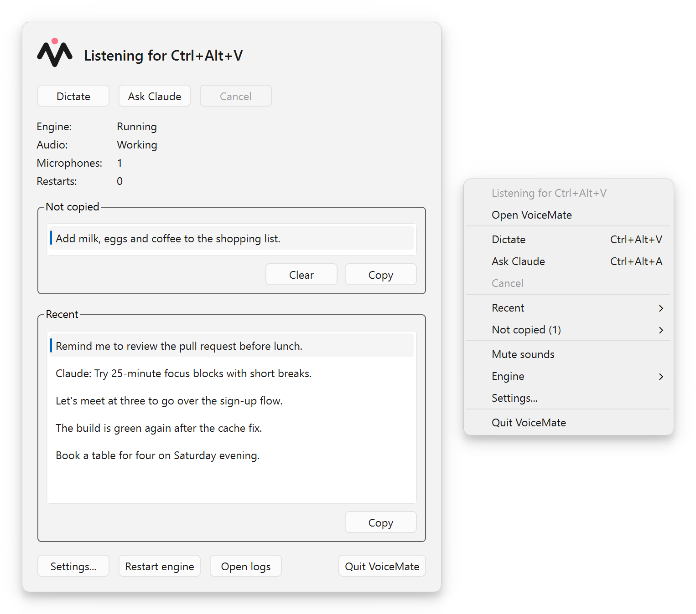
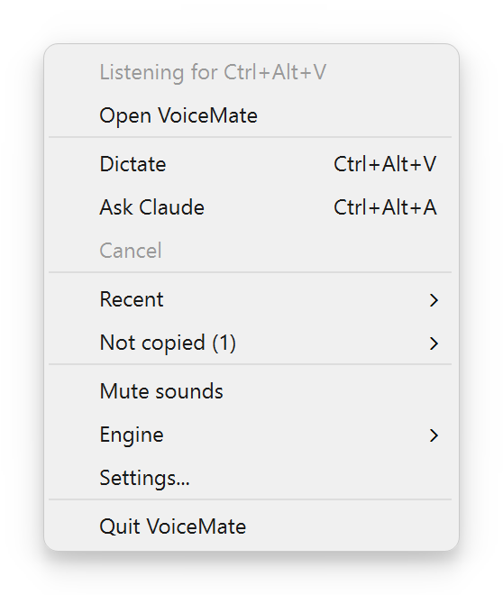
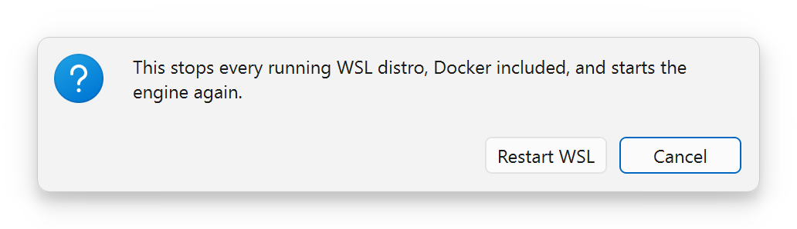
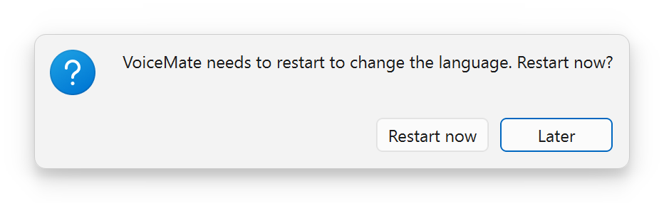
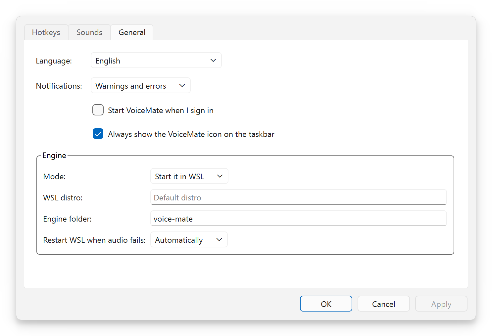
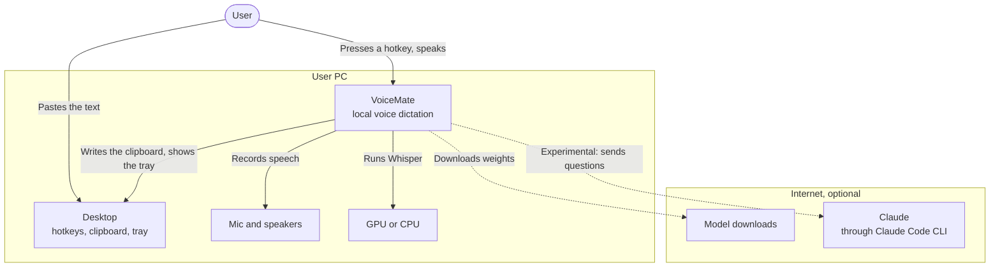
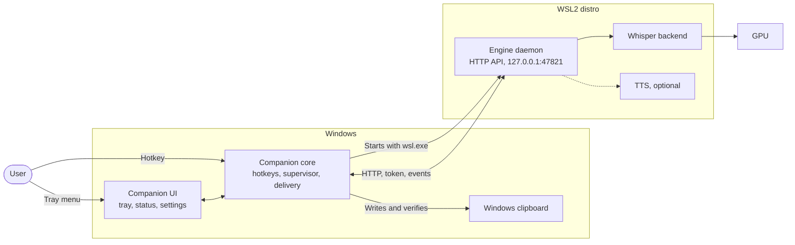
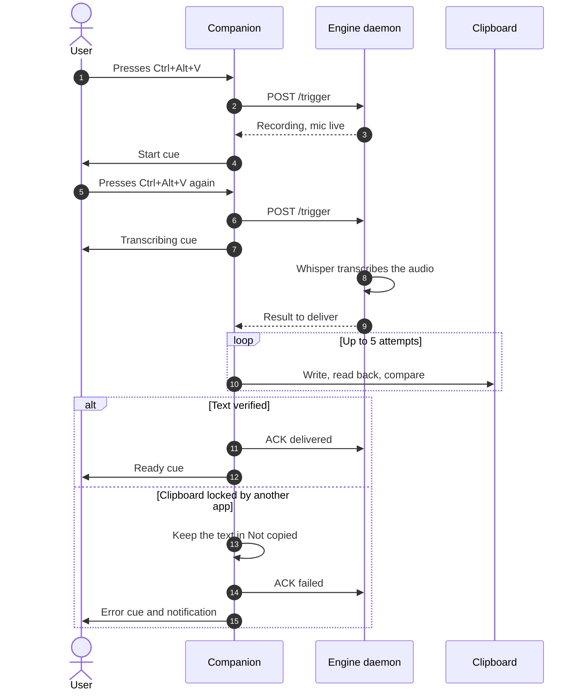
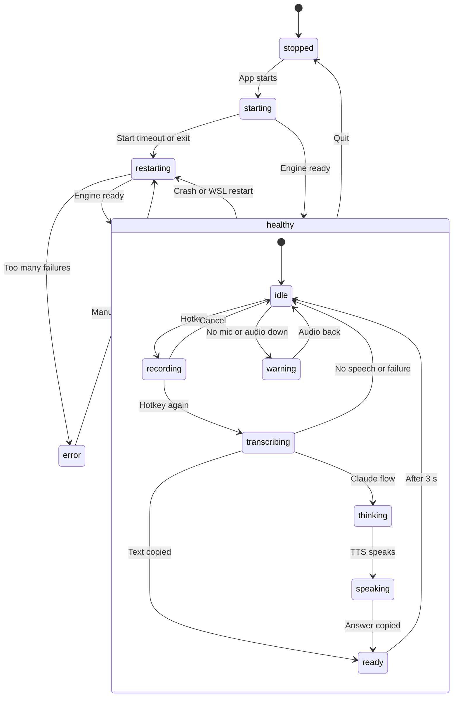
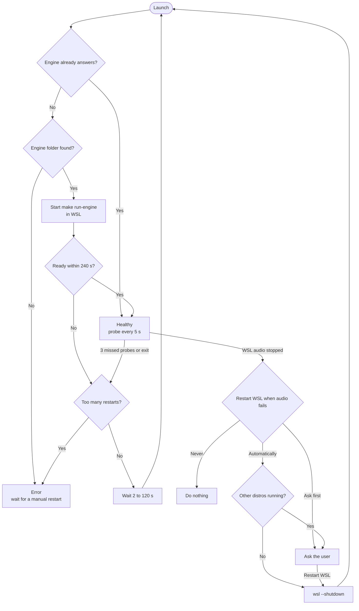

**English** | [Português](README.pt-BR.md) | [Español](README.es.md) | [Русский](README.ru.md) | [简体中文](README.zh-CN.md)

<div align="center">

<picture>
  <source media="(prefers-color-scheme: dark)" srcset="docs/assets/brand/banner-dark.png">
  <source media="(prefers-color-scheme: light)" srcset="docs/assets/brand/banner-light.png">
  
</picture>

**Press a hotkey, speak, paste. Local voice dictation to the clipboard, powered by Whisper on your own computer.**

[](https://github.com/nano-br/voice-mate/actions/workflows/ci.yml)
[](https://github.com/nano-br/voice-mate/releases/latest)
[](LICENSE)
[](pyproject.toml)
[-0078D6?style=flat)](#platforms-and-gpus)
[](#languages)

[Download](https://github.com/nano-br/voice-mate/releases/latest) · [Quick start](#quick-start) · [Documentation](#documentation) · [Changelog](CHANGELOG.md)



</div>

## Why VoiceMate

I built VoiceMate because I believe one simple thing: the faster and easier it is to express an idea to an AI, and the more detail you give it, the better the result. Speaking is much faster than typing. When you think out loud, you explain an idea the way you would explain it to another person, with far more context than you would ever type.

VoiceMate turns speech into text instantly, ready for any AI tool: a prompt for a coding assistant, a message in a chat tool, anything you can paste. Press a hotkey, speak naturally, press it again and paste. Whisper runs locally, so your audio stays on your computer. There is no cloud service and no fee.

Dictation to the clipboard is the core of VoiceMate and the workflow I use every day. I have used it for real work practically every working day since March 2026. It was built and battle-tested on Windows with an NVIDIA GPU. When I replaced my GPU with an AMD card, I adapted VoiceMate to AMD through WSL2 and Linux, and it is now tested there too. That path is still **experimental**.

A second module came later: a voice conversation with Claude. You speak, Claude answers, and the answer is read aloud with text-to-speech (TTS). This module is optional and **experimental**.

## Contents

[Features](#features) · [Screenshots](#screenshots) · [Quick start](#quick-start) · [Usage](#usage) · [Configuration](#configuration) · [Architecture](#architecture) · [Troubleshooting](#troubleshooting) · [Documentation](#documentation) · [Contributing](#contributing) · [License](#license)

## Features

**Dictation (core)**
- One hotkey starts and stops the recording (`Ctrl+Alt+V` by default). The text lands in the clipboard, ready to paste.
- Local Whisper models, `large-v3-turbo` by default. No audio leaves your computer.
- The dictation language is pinned for stable results, and English technical terms inside other languages are still transcribed.
- Sound cues for start, transcribing, copied, warning and error. A recording stops by itself after 10 minutes (configurable).

**Windows companion app**
- A tray icon that shows the state at a glance and follows the light or dark taskbar.
- A status window with recent transcriptions and the **Not copied** list.
- Settings for hotkeys, sound cues (built-in sounds or your own WAV files), notifications, language and the engine.
- Verified clipboard delivery: the app writes the text, reads it back and compares. A text that cannot reach the clipboard stays in **Not copied**, even after a restart.
- A supervisor that starts the engine inside WSL2, restarts it when it fails, and restarts WSL when its audio stops.
- A per-user installer (no administrator prompt) in 5 languages.

<a id="platforms-and-gpus"></a>**Platforms and GPUs**
- Windows 10/11 with NVIDIA (CUDA): the original path, battle-tested. The engine runs natively from the command line.
- **Experimental:** the engine inside WSL2 (the companion's setup), AMD GPUs (ROCm, Vulkan) on WSL2, Linux and Windows, and Linux (X11, Wayland) with an optional companion.
- CPU fallback everywhere. `make setup` detects the platform and the GPU and installs the matching PyTorch build and speech-to-text backend.

<a id="languages"></a>**Languages**: the companion, the engine messages and the installer speak English, Brazilian Portuguese, Spanish, Russian and Simplified Chinese.

**Voice conversation with Claude (experimental)**
- `Ctrl+Alt+A` sends your speech to Claude through the Claude Code CLI. The answer is copied to the clipboard and read aloud.
- TTS engines: OmniVoice (default), Kokoro and VoxCPM2. The conversation continues across turns; any hotkey interrupts the answer and starts a new recording.

## Screenshots

| The tray menu | "Restart WSL?" and "Restart VoiceMate?" |
|:---:|:---:|
|  | <br> |

<p align="center"><br><sub>"VoiceMate Settings", "General" tab. Also: the <a href="docs/assets/screenshots/en/settings-hotkeys.png">"Hotkeys"</a> and <a href="docs/assets/screenshots/en/settings-sounds.png">"Sounds"</a> tabs.</sub></p>

<p align="center"></p>

| Badge (left to right) | State | What the menu and tooltip say |
|---|---|---|
| No badge | Idle | "Listening for Ctrl+Alt+V" |
| Red dot | Recording | "Recording 00:12" |
| Hourglass | Transcribing | "Transcribing..." |
| Speech bubble | Thinking (Claude) | "Claude is answering..." |
| Speaker | Speaking (Claude) | "Claude is answering..." |
| Check mark | Ready, for 3 seconds | "Copied: ..." |
| Ring | Starting | "Starting engine..." |
| Circular arrow | Restarting | "Restarting (attempt 2)" |
| Triangle | Warning | "No microphone" or "WSL audio stopped" |
| Cross | Error | "The engine stopped working" |
| Dimmed icon | Stopped | "VoiceMate is stopped" |

## Quick start

### Windows, with the installer

The installer contains the companion app only. The engine runs inside a WSL2 distro, so set that up first (**experimental**; full guide in [docs/installation.md](docs/installation.md)).

1. In WSL2 (Ubuntu), install Python 3.12, Poetry, `make` and `git`. Then clone the engine into your home folder and run the guided setup: `git clone https://github.com/nano-br/voice-mate.git ~/voice-mate && cd ~/voice-mate && make setup`.
   The companion looks for the engine in `~/voice-mate`, `~/ai-lab/voice-mate`, `~/workspace/voice-mate`, `~/projects/voice-mate`, `~/src/voice-mate`, `~/code/voice-mate`, `~/dev/voice-mate`, `~/git/voice-mate` and `~/repos/voice-mate`. Anywhere else: set "Engine folder:" in Settings. With an AMD GPU, also install the AMD driver and ROCm for WSL ([docs/wsl2.md](docs/wsl2.md)).
2. Download `VoiceMate-Setup-x.y.z.exe` from the [latest release](https://github.com/nano-br/voice-mate/releases/latest).
3. Run it. The installer is not code-signed, so Windows SmartScreen may warn you: choose **More info**, then **Run anyway**. It installs for your user only, with no administrator prompt.
4. Start VoiceMate. The tray shows "Starting engine..." while the model loads (10 to 60 seconds), then "Listening for Ctrl+Alt+V".
5. Optional: pin it to the taskbar. Open Start, search for VoiceMate, right-click it and choose **Pin to taskbar**.

### From source

You need Python 3.12, [Poetry](https://python-poetry.org/docs/#installation), GNU `make` and `git`.

```bash
git clone https://github.com/nano-br/voice-mate.git
cd voice-mate
make setup    # detects platform and GPU, installs PyTorch and the modules you choose
make doctor   # checks microphone, audio, hotkeys and GPU, and prints a fix for each problem
make run      # starts the engine with its own hotkeys (Windows native or Linux)
```

To run the companion from source on Windows, with the engine in WSL2: `make companion-venv` once, then `make run-tray`. The companion starts the engine with `make run-engine` itself.

### Linux (experimental)

Run `make setup` and `make run` as above. For the optional tray and status window: `poetry install --extras ui`, then `make run-tray`. Details in [docs/installation.md](docs/installation.md#linux-experimental).

## Usage

| Hotkey | Tray menu action | What happens |
|---|---|---|
| `Ctrl+Alt+V` | "Dictate" | Speech to text, copied to the clipboard |
| `Ctrl+Alt+A` | "Ask Claude" | Speech to Claude, answer copied and read aloud (**experimental**) |

Press `Ctrl+Alt+V`, speak after the start cue, press `Ctrl+Alt+V` again, then paste with `Ctrl+V` anywhere. The hotkey that stops the recording decides where the text goes. A text that could not reach the clipboard waits in **Not copied** (tray menu and status window), where one click copies it. To quit, choose **Quit VoiceMate** in the tray menu; an engine that the companion did not start keeps running.

The dictation language is chosen in Settings > **General** ("Dictation language"); by default it follows the interface language. From the command line, use `--transcription-language` or `--output-lang`.

The voice conversation with Claude needs the Claude Code CLI installed and signed in, and the `claude` module chosen in `make setup`. See [docs/usage.md](docs/usage.md#claude-flow-experimental).

## Configuration

| What | Where |
|---|---|
| Companion settings | Windows `%APPDATA%\VoiceMate\companion.toml`, Linux `~/.config/voicemate/companion.toml` |
| Engine choices from `make setup` | `~/.config/voicemate/config.toml` (inside WSL for the companion) |
| Engine API token | `~/.config/voicemate/api-token` |
| Engine HTTP API | `127.0.0.1:47821` |
| Logs (`companion.log`, `engine.log`) | Windows `%LOCALAPPDATA%\VoiceMate\logs`, Linux `~/.local/state/voicemate/logs` |
| **Not copied** list | `pending.json` next to the `logs` folder |

Every engine flag, every settings key and every environment variable: [docs/configuration.md](docs/configuration.md).

## Architecture

VoiceMate has two parts. The **engine** records, transcribes and runs the Claude flow; it is a Python daemon with a local HTTP API. The **companion** is a PySide6 tray app on Windows that owns the hotkeys and the clipboard and supervises the engine inside WSL2. The engine also runs alone from the command line.

<details>
<summary>System context</summary>



</details>

<details>
<summary>Containers (Windows with WSL2)</summary>



</details>

<details>
<summary>One dictation, step by step</summary>



</details>

<details>
<summary>Tray states</summary>



</details>

<details>
<summary>Engine supervisor and WSL audio recovery</summary>



</details>

Component diagrams, the HTTP API and the design choices: [docs/architecture.md](docs/architecture.md).

## Troubleshooting

| Symptom | What to do |
|---|---|
| "Starting engine..." for a long time | The first model load takes 10 to 60 seconds. Open **Engine** > **Open logs** and read `engine.log`. Check "WSL distro:" and "Engine folder:" in Settings. |
| "Engine folder not found" | Clone the engine into one of the folders listed in [Quick start](#windows-with-the-installer), or set "Engine folder:" in Settings > **General**. |
| A hotkey says "Used by another app" | An old VoiceMate hotkey script may still run. Close it and remove it from `shell:startup`, or choose other hotkeys. |
| "WSL audio stopped" or "No microphone" | Connect a microphone. VoiceMate restarts WSL as set in "Restart WSL when audio fails:"; to do it by hand, use **Engine** > **Restart WSL...**. |
| A text did not reach the clipboard | It is in **Not copied** (tray menu and status window). Click it to copy it again. |
| Something else on the engine side | Run `make doctor` in the engine folder. It prints a fix for each failed check. |

More problems and the exact messages: [docs/troubleshooting.md](docs/troubleshooting.md).

## Documentation

- [Installation](docs/installation.md): every install path, updating and uninstalling.
- [Usage](docs/usage.md): flows, hotkeys, models and voice options.
- [Configuration](docs/configuration.md): engine flags, settings files, environment variables.
- [Troubleshooting](docs/troubleshooting.md): `make doctor`, WSL audio, logs, known messages.
- [Architecture](docs/architecture.md): diagrams and design choices.
- [WSL2 and AMD](docs/wsl2.md) (experimental), [Companion design](docs/companion-app.md), [Brand](docs/brand.md), [Releasing](docs/releasing.md).

## Contributing

Issues and pull requests are welcome. Every dev command goes through the Makefile: `make format lint test` for the engine (Ruff and strict mypy), and `make companion-lint companion-test` for the companion. Every user-facing string exists in 5 languages through gettext. Commits follow Conventional Commits and explain the context. Read [CONTRIBUTING.md](CONTRIBUTING.md) first.

## Acknowledgements

VoiceMate stands on the work of many projects: [Whisper](https://github.com/openai/whisper) by OpenAI, [faster-whisper](https://github.com/SYSTRAN/faster-whisper), [whisper.cpp](https://github.com/ggml-org/whisper.cpp), [CTranslate2-ROCm](https://github.com/arlo-phoenix/CTranslate2-rocm), [PySide6](https://doc.qt.io/qtforpython-6/), [OmniVoice](https://huggingface.co/k2-fsa/OmniVoice), [Kokoro](https://github.com/hexgrad/kokoro), [VoxCPM](https://github.com/OpenBMB/VoxCPM), the [Claude Agent SDK](https://github.com/anthropics/claude-agent-sdk-python) with [Claude Code](https://docs.claude.com/en/docs/claude-code), [Inno Setup](https://jrsoftware.org/isinfo.php) and [PyInstaller](https://pyinstaller.org/).

## License

[MIT](LICENSE) © Álli Terhorst. Part of [NanoBR](https://github.com/nano-br): open source utilities for everyday productivity.
