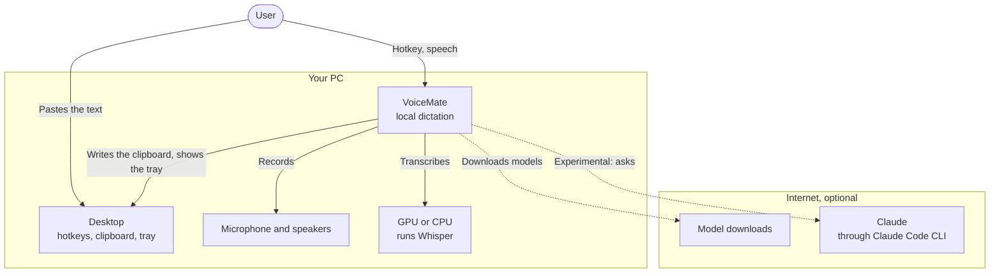
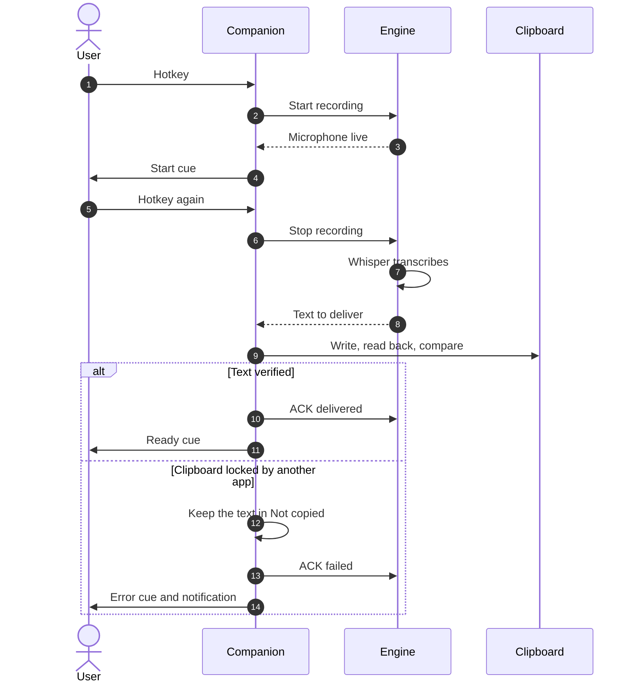
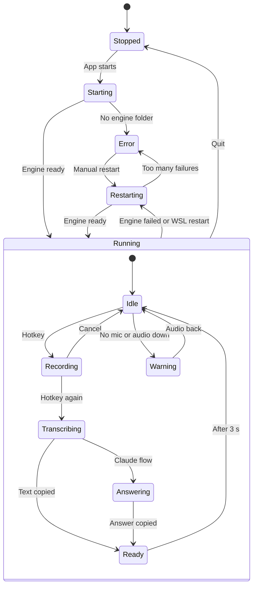
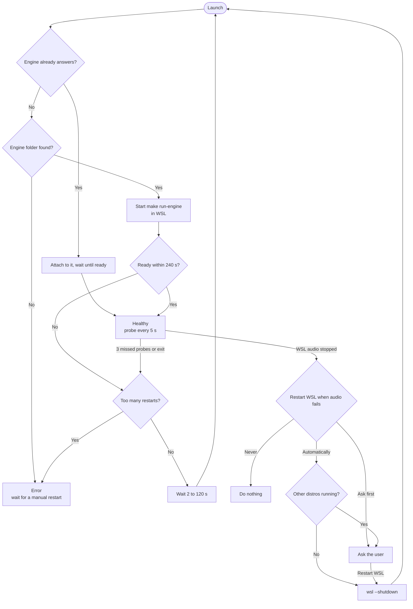

**English** | [Português](README.pt-BR.md) | [Español](README.es.md) | [Русский](README.ru.md) | [简体中文](README.zh-CN.md)

<div align="center">

<picture>
  <source media="(prefers-color-scheme: dark)" srcset="docs/assets/brand/banner-dark.png">
  <source media="(prefers-color-scheme: light)" srcset="docs/assets/brand/banner-light.png">
  
</picture>

**Press a hotkey, speak, paste. Local voice dictation to the clipboard, powered by Whisper on your own computer.**

[](https://github.com/nano-br/voice-mate/actions/workflows/ci.yml)
[](https://github.com/nano-br/voice-mate/releases/latest)
[](LICENSE)
[](pyproject.toml)
[-0078D6?style=flat)](#platforms-and-gpus)
[](#languages)

[Download](https://github.com/nano-br/voice-mate/releases/latest) · [Quick start](#quick-start) · [Documentation](#documentation) · [Changelog](CHANGELOG.md)


</div>

## Why VoiceMate

I built VoiceMate because I believe one simple thing: the faster and easier it is to express an idea to an AI, and the more detail you give it, the better the result. Speaking is much faster than typing. When you think out loud, you explain an idea the way you would explain it to another person, with far more context than you would ever type.

VoiceMate turns speech into text instantly, ready for any AI tool: a prompt for a coding assistant, a message in a chat tool, anything you can paste. Press a hotkey, speak naturally, press it again and paste. Whisper runs locally, so your audio stays on your computer. Dictation needs no cloud service and no fee.

Dictation to the clipboard is the core of VoiceMate. I have used it for real work practically every working day since March 2026. It was built and battle-tested on Windows with an NVIDIA GPU. When I replaced my GPU with an AMD card, I adapted VoiceMate to AMD through WSL2 and Linux, and it is now tested there too. That path is still **experimental**.

A second module came later: a voice conversation with Claude. You speak, Claude answers, and the answer is read aloud with text-to-speech (TTS). This module is optional and **experimental**.

## Contents

[Features](#features) · [Screenshots](#screenshots) · [Quick start](#quick-start) · [Usage](#usage) · [Configuration](#configuration) · [Architecture](#architecture) · [Troubleshooting](#troubleshooting) · [Documentation](#documentation) · [Contributing](#contributing) · [License](#license)

## Features

**Dictation (core)**
- One hotkey starts and stops the recording (`Ctrl+Alt+V` by default). The text lands in the clipboard, ready to paste.
- Local Whisper models, `large-v3-turbo` by default. No audio leaves your computer.
- The dictation language is pinned for stable results, and English technical terms inside other languages are still transcribed.
- Sound cues for start, transcribing, copied, warning and error. A recording stops by itself after 10 minutes (configurable).

**Windows companion app**
- A tray icon that shows the state at a glance, a status window with recent transcriptions, and settings for hotkeys, sound cues, notifications, language and the engine.
- Verified clipboard delivery: the app writes the text, reads it back and compares. A text that cannot reach the clipboard stays in **Not copied**, even after a restart.
- A supervisor that starts the engine inside WSL2, restarts it when it fails, and restarts WSL when its audio stops.
- A per-user installer (no administrator prompt) in 5 languages.

<a id="languages"></a>**Languages**: the companion, the engine messages and the installer speak English, Brazilian Portuguese, Spanish, Russian and Simplified Chinese.

<a id="platforms-and-gpus"></a>**Platforms and GPUs**
- Windows 10/11 with NVIDIA (CUDA): the original path, battle-tested. The engine runs natively from the command line.
- **Experimental:** the engine inside WSL2 (the companion's setup), AMD GPUs (ROCm, Vulkan) on WSL2, Linux and Windows, and Linux (X11, Wayland) with an optional companion.
- CPU fallback everywhere. `make setup` detects the platform and the GPU and installs the matching PyTorch build and speech-to-text backend.

**Voice conversation with Claude (experimental)**
- `Ctrl+Alt+A` sends your speech to Claude through the Claude Code CLI (your own sign-in: the transcribed text goes to Anthropic, the audio does not). The answer is copied to the clipboard and read aloud.
- TTS engines: OmniVoice (the engine used when nothing is saved), Kokoro (the one `make setup` proposes) and VoxCPM2. The conversation continues across turns; any hotkey interrupts the answer and starts a new recording.

## Screenshots

| The tray menu | "Restart WSL?" and "Restart VoiceMate?" |
|:---:|:---:|
|  | <br> |

<p align="center"><br><sub>"VoiceMate Settings", "General" tab. Also: the <a href="docs/assets/screenshots/en/settings-hotkeys.png">"Hotkeys"</a> and <a href="docs/assets/screenshots/en/settings-sounds.png">"Sounds"</a> tabs.</sub></p>

<p align="center"><br><sub>The tray icon shows the state with a badge. What each badge means: <a href="docs/usage.md#tray-icon-and-menu">Usage, tray icon and menu</a>.</sub></p>

## Quick start

### Windows, with the installer

The installer contains the companion app only. The engine runs inside a WSL2 distro, so set that up first (**experimental**; full guide in [docs/installation.md](docs/installation.md)).

1. In PowerShell, install WSL2 with Ubuntu: `wsl --install -d Ubuntu-24.04`, then open Ubuntu (if you already had another WSL distro, also run `wsl --set-default Ubuntu-24.04`, or set "WSL distro:" in Settings later). Inside it, install the audio packages; Python 3.12 (Ubuntu 24.04 ships it) and [Poetry](https://python-poetry.org/docs/#installation) must be on the `PATH` of a login shell too:
   ```bash
   sudo apt install -y libportaudio2 libasound2-plugins pulseaudio-utils wl-clipboard git make
   ```
2. Clone the engine and run the guided setup:
   ```bash
   git clone https://github.com/nano-br/voice-mate.git ~/voice-mate
   cd ~/voice-mate
   make setup    # for dictation only, answer 1 (clipboard) to "Which main flow?"
   make doctor   # every check should show a check mark
   ```
   The companion looks for the engine in `~/voice-mate` and a few other usual folders ([the list](docs/installation.md#2-install-the-engine)); anywhere else, set "Engine folder:" in Settings. With an AMD GPU, also install the AMD driver and ROCm for WSL ([docs/wsl2.md](docs/wsl2.md)).
3. Recommended: still in `~/voice-mate`, run `make run` once and stop it with `Ctrl+C` when it has loaded. The very first start downloads the Whisper model, and the companion gives an engine start only 240 seconds (it stops retrying after 3 start timeouts in a row), which a slow connection can exceed.
4. Download `VoiceMate-Setup-x.y.z.exe` from the [latest release](https://github.com/nano-br/voice-mate/releases/latest) and run it. The installer is not code-signed, so Windows SmartScreen may warn you: choose **More info**, then **Run anyway**. It installs for your user only, with no administrator prompt.
5. Start VoiceMate. The tray shows "Starting engine..." while the model loads (10 to 60 seconds once the model is downloaded), then "Listening for Ctrl+Alt+V".
6. Optional: pin it to the taskbar. Open Start, search for VoiceMate, right-click it and choose **Pin to taskbar**.

### From source

You need Python 3.12, [Poetry](https://python-poetry.org/docs/#installation), GNU `make` (on Windows, install it first, for example with Chocolatey or Scoop) and `git`.

```bash
git clone https://github.com/nano-br/voice-mate.git
cd voice-mate
make setup                           # detects platform and GPU, installs PyTorch and the modules you choose
make doctor                          # checks microphone, audio, hotkeys and GPU, and prints a fix for each problem
make run ARGS="--output-lang en"     # starts the engine with its own hotkeys (Windows native or Linux)
```

**The engine defaults to Portuguese** (`--output-lang pt-BR`), which sets the language Whisper hears, Claude's answers and the engine messages. Pass `--output-lang en` (or another code) as above; `--transcription-language` and `VOICEMATE_LANG` change one of them only ([configuration](docs/configuration.md)). The companion passes these flags itself, see [Usage](#usage).

To run the companion from source on Windows, with the engine in WSL2: `make companion-venv` once, then `make run-tray`. On Linux, run `make setup` and `make run` as above; for the optional tray and status window, `poetry install --extras ui` and then `make run-tray` ([details](docs/installation.md#linux-experimental)).

## Usage

| Hotkey | Tray menu action | What happens |
|---|---|---|
| `Ctrl+Alt+V` | "Dictate" | Speech to text, copied to the clipboard |
| `Ctrl+Alt+A` | "Ask Claude" | Speech to Claude, answer copied and read aloud (**experimental**) |

Press `Ctrl+Alt+V`, speak after the start cue, press `Ctrl+Alt+V` again, then paste with `Ctrl+V` anywhere. The hotkey that stops the recording decides where the text goes. A text that could not reach the clipboard waits in **Not copied** (tray menu and status window), where one click copies it. To quit, choose **Quit VoiceMate** in the tray menu; an engine that the companion did not start keeps running.

**Dictation language.** In Settings > **General**, "Dictation language:" decides the language you speak. The default is "Same as the interface"; "Detect automatically" lets Whisper detect each recording (Claude keeps answering in the interface language; with Kokoro, pin a language instead); or pick one language. The companion passes it to the engine it starts as `--transcription-language` and `--output-lang`, and changing it restarts the engine. An engine the companion only connects to (a systemd unit, or one started by hand) keeps its own flags.

The voice conversation with Claude needs the Claude Code CLI installed and signed in, and the `claude` module chosen in `make setup`. See [docs/usage.md](docs/usage.md#claude-flow-experimental).

## Configuration

| What | Where |
|---|---|
| Companion settings | Windows `%APPDATA%\VoiceMate\companion.toml`, Linux `~/.config/voicemate/companion.toml` |
| Engine choices from `make setup`, API token | `~/.config/voicemate/` (inside WSL for the companion; `%USERPROFILE%\.config\voicemate\` for an engine run natively on Windows) |
| Engine HTTP API | `127.0.0.1:47821` |
| Logs (`companion.log`, `engine.log`) | Windows `%LOCALAPPDATA%\VoiceMate\logs`, Linux `~/.local/state/voicemate/logs` |
| **Not copied** list | `pending.json` next to the `logs` folder |

Every engine flag, every settings key and every environment variable: [docs/configuration.md](docs/configuration.md).

## Architecture

VoiceMate has two parts. The **engine** records, transcribes and runs the Claude flow; it is a Python daemon with a local HTTP API. The **companion** is a PySide6 tray app on Windows that owns the hotkeys and the clipboard and supervises the engine inside WSL2. The engine also runs alone from the command line. The diagrams below are simplified overviews; each one links to the full diagram in [docs/architecture.md](docs/architecture.md), which also has the component diagrams, the HTTP API and the design choices.

<details>
<summary>System context (overview)</summary>



Overview. Full diagram: [docs/architecture.md, System context](docs/architecture.md#1-system-context).

</details>

<details>
<summary>Containers, Windows with WSL2 (overview)</summary>


Overview. Full diagram: [docs/architecture.md, Containers](docs/architecture.md#2-containers).

</details>

<details>
<summary>One dictation, step by step (overview)</summary>



Overview. Full diagram: [docs/architecture.md, One dictation](docs/architecture.md#4-runtime-one-dictation).

</details>

<details>
<summary>Tray states (overview)</summary>



Overview. Full diagram: [docs/architecture.md, Tray states](docs/architecture.md#5-tray-states).

</details>

<details>
<summary>Engine supervisor and WSL audio recovery (overview)</summary>



Overview. Full diagram: [docs/architecture.md, Supervisor](docs/architecture.md#6-supervisor-on-windows-and-wsl2).

</details>

## Troubleshooting

| Symptom | What to do |
|---|---|
| "Starting engine..." for a long time | The first start downloads the model, which can take minutes (run `make run` once in WSL, see [Quick start](#windows-with-the-installer)). Later starts take 10 to 60 seconds. Open **Engine** > **Open logs** and read `engine.log`. |
| "Engine folder not found" | Clone the engine into one of the [usual folders](docs/installation.md#2-install-the-engine), or set "Engine folder:" in Settings > **General**. |
| A hotkey says "Used by another app" | An old VoiceMate hotkey script may still run. Close it and remove it from `shell:startup`, or choose other hotkeys. |
| "WSL audio stopped" or "No microphone" | Connect a microphone. VoiceMate restarts WSL as set in "Restart WSL when audio fails:"; to do it by hand, use **Engine** > **Restart WSL...**. |
| A text did not reach the clipboard | It is in **Not copied** (tray menu and status window). Click it to copy it again. |
| English speech comes out wrong, or engine messages are in Portuguese | An engine started by hand defaults to Portuguese: add `ARGS="--output-lang en"` to `make run`. |
| Something else on the engine side | Run `make doctor` in the engine folder. It prints a fix for each failed check. |

More problems and the exact messages: [docs/troubleshooting.md](docs/troubleshooting.md).

## Documentation

- [Installation](docs/installation.md): every install path, updating and uninstalling.
- [Usage](docs/usage.md): flows, hotkeys, tray icon, models and voice options.
- [Configuration](docs/configuration.md): engine flags, settings files, environment variables.
- [Troubleshooting](docs/troubleshooting.md): `make doctor`, WSL audio, logs, known messages.
- [Architecture](docs/architecture.md): diagrams and design choices.
- [WSL2 and AMD](docs/wsl2.md) (experimental), [Companion design](docs/companion-app.md), [Brand](docs/brand.md), [Releasing](docs/releasing.md).

## Contributing

Issues and pull requests are welcome. Every dev command goes through the Makefile: `make format lint test` for the engine (Ruff and strict mypy), and `make companion-lint companion-test` for the companion. Every user-facing string exists in 5 languages through gettext. Commits follow Conventional Commits and explain the context. Read [CONTRIBUTING.md](CONTRIBUTING.md) first.

## Acknowledgements

VoiceMate stands on the work of many projects: [Whisper](https://github.com/openai/whisper) by OpenAI, [faster-whisper](https://github.com/SYSTRAN/faster-whisper), [whisper.cpp](https://github.com/ggml-org/whisper.cpp), [CTranslate2-ROCm](https://github.com/arlo-phoenix/CTranslate2-rocm), [PySide6](https://doc.qt.io/qtforpython-6/), [OmniVoice](https://huggingface.co/k2-fsa/OmniVoice), [Kokoro](https://github.com/hexgrad/kokoro), [VoxCPM](https://github.com/OpenBMB/VoxCPM), the [Claude Agent SDK](https://github.com/anthropics/claude-agent-sdk-python) with [Claude Code](https://docs.claude.com/en/docs/claude-code), [Inno Setup](https://jrsoftware.org/isinfo.php) and [PyInstaller](https://pyinstaller.org/).

## License

[MIT](LICENSE) © Álli Terhorst. Part of [NanoBR](https://github.com/nano-br): open source utilities for everyday productivity.
