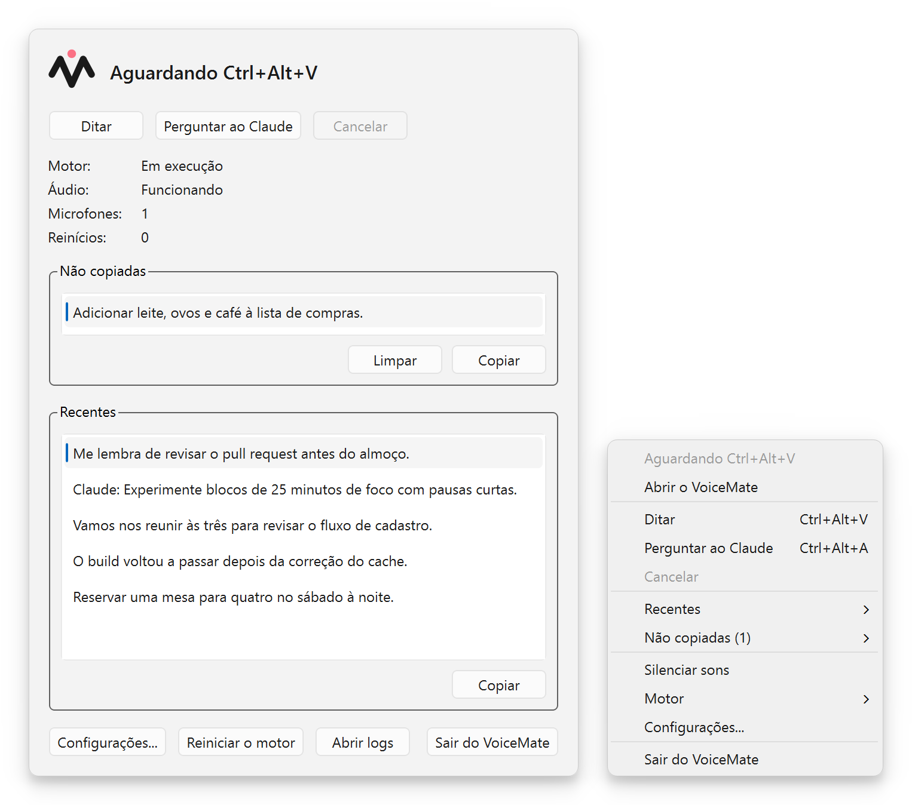
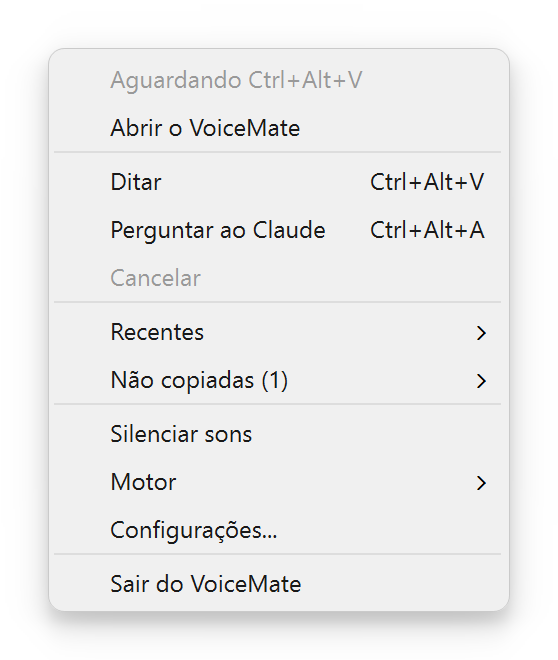
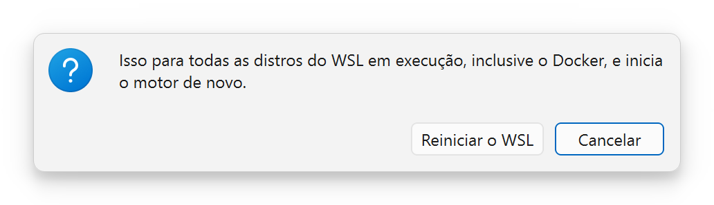
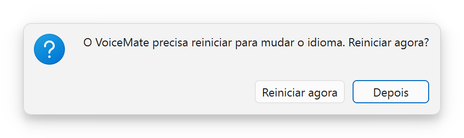
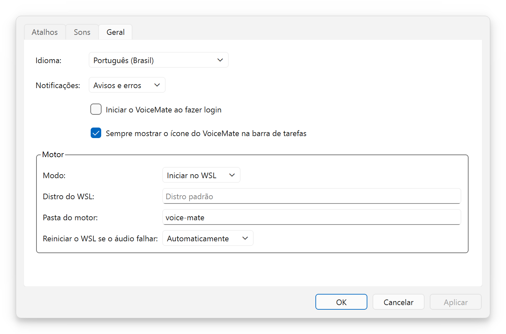
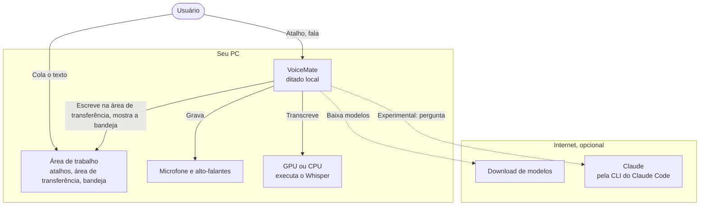
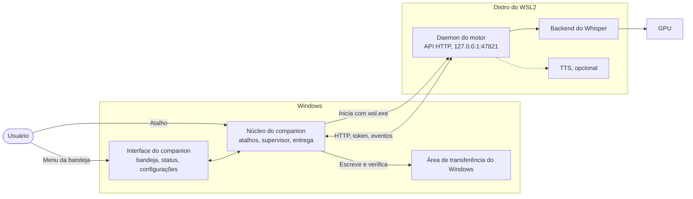
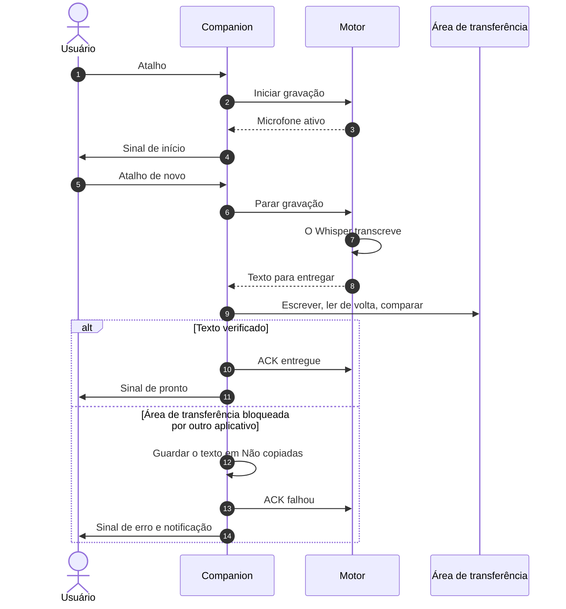
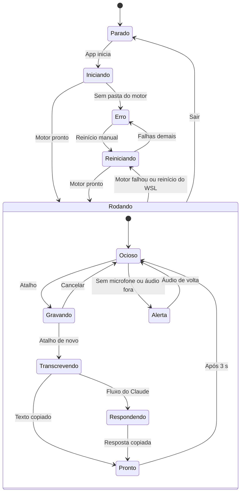
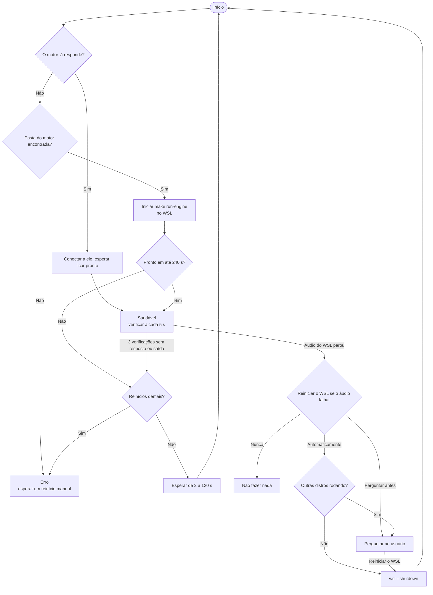

[English](README.md) | **Português** | [Español](README.es.md) | [Русский](README.ru.md) | [简体中文](README.zh-CN.md)

<div align="center">

<picture>
  <source media="(prefers-color-scheme: dark)" srcset="docs/assets/brand/banner-dark.png">
  <source media="(prefers-color-scheme: light)" srcset="docs/assets/brand/banner-light.png">
  
</picture>

**Aperte um atalho, fale, cole. Ditado por voz local para a área de transferência, com o Whisper rodando no seu próprio computador.**

[](https://github.com/nano-br/voice-mate/actions/workflows/ci.yml)
[](https://github.com/nano-br/voice-mate/releases/latest)
[](LICENSE)
[](pyproject.toml)
[-0078D6?style=flat)](#plataformas-e-gpus)
[](#idiomas)

[Baixar](https://github.com/nano-br/voice-mate/releases/latest) · [Início rápido](#início-rápido) · [Documentação](#documentação) · [Changelog](CHANGELOG.md)



</div>

## Por que o VoiceMate

Criei o VoiceMate porque acredito numa coisa simples: quanto mais rápido e fácil é expressar uma ideia para uma IA, e quanto mais detalhes você dá, melhor o resultado. Falar é muito mais rápido do que digitar. Quando você pensa em voz alta, explica a ideia como explicaria a outra pessoa, com muito mais contexto do que jamais digitaria.

O VoiceMate transforma fala em texto na hora, pronto para qualquer ferramenta de IA: um prompt para um assistente de código, uma mensagem num chat, qualquer coisa que dê para colar. Aperte um atalho, fale naturalmente, aperte de novo e cole. O Whisper roda localmente, então o seu áudio fica no seu computador. O ditado não precisa de serviço na nuvem nem de mensalidade.

O ditado para a área de transferência é o coração do VoiceMate. Uso no trabalho de verdade, praticamente todo dia útil, desde março de 2026. Ele nasceu e foi testado a fundo no Windows com uma GPU NVIDIA. Quando troquei minha GPU por uma AMD, adaptei o VoiceMate para AMD via WSL2 e Linux, e hoje ele também é testado lá. Esse caminho ainda é **experimental**.

Um segundo módulo veio depois: uma conversa por voz com o Claude. Você fala, o Claude responde, e a resposta é lida em voz alta com síntese de voz (TTS). Esse módulo é opcional e **experimental**.

## Sumário

[Recursos](#recursos) · [Capturas de tela](#capturas-de-tela) · [Início rápido](#início-rápido) · [Uso](#uso) · [Configuração](#configuração) · [Arquitetura](#arquitetura) · [Solução de problemas](#solução-de-problemas) · [Documentação](#documentação) · [Como contribuir](#como-contribuir) · [Licença](#licença)

## Recursos

**Ditado (o essencial)**
- Um único atalho inicia e para a gravação (`Ctrl+Alt+V` por padrão). O texto vai para a área de transferência, pronto para colar.
- Modelos Whisper locais, `large-v3-turbo` por padrão. Nenhum áudio sai do seu computador.
- O idioma do ditado fica fixado para dar resultados estáveis, e termos técnicos em inglês no meio de outros idiomas continuam sendo transcritos.
- Sons de aviso para início, transcrição, copiado, alerta e erro. Uma gravação para sozinha após 10 minutos (configurável).

**Aplicativo companion para Windows**
- Um ícone na bandeja que mostra o estado num relance, uma janela de status com as transcrições recentes e configurações para atalhos, sons de aviso, notificações, idioma e o motor.
- Entrega verificada na área de transferência: o aplicativo escreve o texto, lê de volta e compara. Um texto que não consegue chegar à área de transferência fica em **Não copiadas**, mesmo depois de reiniciar.
- Um supervisor que inicia o motor dentro do WSL2, reinicia o motor quando ele falha e reinicia o WSL quando o áudio dele para.
- Um instalador por usuário (sem pedir permissão de administrador) em 5 idiomas.

<a id="idiomas"></a>**Idiomas**: o companion, as mensagens do motor e o instalador falam inglês, português do Brasil, espanhol, russo e chinês simplificado.

<a id="plataformas-e-gpus"></a>**Plataformas e GPUs**
- Windows 10/11 com NVIDIA (CUDA): o caminho original, testado a fundo. O motor roda nativamente pela linha de comando.
- **Experimental:** o motor dentro do WSL2 (a configuração do companion), GPUs AMD (ROCm, Vulkan) no WSL2, no Linux e no Windows, e Linux (X11, Wayland) com um companion opcional.
- CPU como alternativa em qualquer lugar. O `make setup` detecta a plataforma e a GPU e instala o build do PyTorch e o backend de reconhecimento de fala correspondentes.

**Conversa por voz com o Claude (experimental)**
- `Ctrl+Alt+A` envia a sua fala ao Claude pela CLI do Claude Code (com o seu próprio login: o texto transcrito vai para a Anthropic, o áudio não). A resposta é copiada para a área de transferência e lida em voz alta.
- Motores de TTS: OmniVoice (o usado quando nada foi salvo), Kokoro (o que o `make setup` propõe) e VoxCPM2. A conversa continua entre os turnos; qualquer atalho interrompe a resposta e inicia uma nova gravação.

## Capturas de tela

| O menu da bandeja | "Reiniciar o WSL?" e "Reiniciar o VoiceMate?" |
|:---:|:---:|
|  | <br> |

<p align="center"><br><sub>"Configurações do VoiceMate", aba "Geral". Veja também as abas <a href="docs/assets/screenshots/pt-BR/settings-hotkeys.png">"Atalhos"</a> e <a href="docs/assets/screenshots/pt-BR/settings-sounds.png">"Sons"</a>.</sub></p>

<p align="center"><br><sub>O ícone da bandeja mostra o estado com um selo. O que cada selo significa: <a href="docs/usage.md#tray-icon-and-menu">Uso, ícone e menu da bandeja</a>.</sub></p>

## Início rápido

### Windows, com o instalador

O instalador traz só o aplicativo companion. O motor roda dentro de uma distro do WSL2, então configure isso primeiro (**experimental**; guia completo em [docs/installation.md](docs/installation.md)).

1. No PowerShell, instale o WSL2 com o Ubuntu: `wsl --install -d Ubuntu-24.04`, e depois abra o Ubuntu (se você já tinha outra distro do WSL, rode também `wsl --set-default Ubuntu-24.04`, ou defina "Distro do WSL:" em Configurações depois). Dentro dele, instale os pacotes de áudio; o Python 3.12 (o Ubuntu 24.04 já traz) e o [Poetry](https://python-poetry.org/docs/#installation) precisam estar no `PATH` de um shell de login também:
   ```bash
   sudo apt install -y libportaudio2 libasound2-plugins pulseaudio-utils wl-clipboard git make
   ```
2. Clone o motor e rode a configuração guiada:
   ```bash
   git clone https://github.com/nano-br/voice-mate.git ~/voice-mate
   cd ~/voice-mate
   make setup    # só para ditado, responda 1 (clipboard) em "Qual flow principal?"
   make doctor   # todas as verificações devem mostrar ✓
   ```
   O companion procura o motor em `~/voice-mate` e em algumas outras pastas comuns ([a lista](docs/installation.md#2-install-the-engine)); em qualquer outro lugar, defina "Pasta do motor:" em Configurações. Com uma GPU AMD, instale também o driver da AMD e o ROCm para WSL ([docs/wsl2.md](docs/wsl2.md)).
3. Recomendado: ainda em `~/voice-mate`, rode `make run` uma vez e pare com `Ctrl+C` quando ele terminar de carregar. A primeira inicialização baixa o modelo Whisper, e o companion dá a uma inicialização do motor só 240 segundos (ele para de tentar depois de 3 estouros de tempo seguidos), o que uma conexão lenta pode ultrapassar.
4. Baixe o `VoiceMate-Setup-x.y.z.exe` da [última versão](https://github.com/nano-br/voice-mate/releases/latest) e execute. O instalador não tem assinatura de código, então o Windows SmartScreen pode avisar: escolha **Mais informações** e depois **Executar assim mesmo**. Ele instala só para o seu usuário, sem pedir permissão de administrador.
5. Abra o VoiceMate. A bandeja mostra "Iniciando o motor..." enquanto o modelo carrega (de 10 a 60 segundos depois que o modelo foi baixado), e então "Aguardando Ctrl+Alt+V".
6. Opcional: fixe na barra de tarefas. Abra o Iniciar, pesquise VoiceMate, clique nele com o botão direito e escolha **Fixar na barra de tarefas**.

### A partir do código-fonte

Você precisa do Python 3.12, do [Poetry](https://python-poetry.org/docs/#installation), do `make` do GNU (no Windows, instale antes, por exemplo com Chocolatey ou Scoop) e do `git`.

```bash
git clone https://github.com/nano-br/voice-mate.git
cd voice-mate
make setup                           # detecta plataforma e GPU, instala o PyTorch e os módulos que você escolher
make doctor                          # verifica microfone, áudio, atalhos e GPU, e mostra a correção para cada problema
make run ARGS="--output-lang en"     # inicia o motor com os próprios atalhos (Windows nativo ou Linux)
```

**O motor usa português por padrão** (`--output-lang pt-BR`), o que define o idioma que o Whisper escuta, as respostas do Claude e as mensagens do motor. Passe `--output-lang en` (ou outro código) como acima; `--transcription-language` e `VOICEMATE_LANG` mudam só um deles ([configuração](docs/configuration.md)). O companion passa essas flags sozinho, veja [Uso](#uso).

Para rodar o companion a partir do código-fonte no Windows, com o motor no WSL2: `make companion-venv` uma vez, depois `make run-tray`. No Linux, rode `make setup` e `make run` como acima; para a bandeja e a janela de status opcionais, `poetry install --extras ui` e depois `make run-tray` ([detalhes](docs/installation.md#linux-experimental)).

## Uso

| Atalho | Ação no menu da bandeja | O que acontece |
|---|---|---|
| `Ctrl+Alt+V` | "Ditar" | Fala vira texto, copiado para a área de transferência |
| `Ctrl+Alt+A` | "Perguntar ao Claude" | Fala enviada ao Claude, resposta copiada e lida em voz alta (**experimental**) |

Aperte `Ctrl+Alt+V`, fale depois do sinal de início, aperte `Ctrl+Alt+V` de novo e cole com `Ctrl+V` em qualquer lugar. O atalho que para a gravação decide para onde o texto vai. Um texto que não conseguiu chegar à área de transferência espera em **Não copiadas** (menu da bandeja e janela de status), onde um clique o copia. Para sair, escolha **Sair do VoiceMate** no menu da bandeja; um motor que o companion não iniciou continua rodando.

**Idioma do ditado.** Em Configurações > **Geral**, "Idioma do ditado:" define o idioma que você fala. O padrão é "Igual ao da interface"; "Detectar automaticamente" deixa o Whisper detectar cada gravação (o Claude continua respondendo no idioma da interface; com o Kokoro, fixe um idioma); ou escolha um idioma. O companion repassa a escolha ao motor que ele inicia como `--transcription-language` e `--output-lang`, e mudar o idioma reinicia o motor. Um motor ao qual o companion só se conecta (uma unidade do systemd, ou um iniciado à mão) mantém as próprias flags.

A conversa por voz com o Claude precisa da CLI do Claude Code instalada e com login feito, e do módulo `claude` escolhido no `make setup`. Veja [docs/usage.md](docs/usage.md#claude-flow-experimental).

## Configuração

| O quê | Onde |
|---|---|
| Configurações do companion | Windows `%APPDATA%\VoiceMate\companion.toml`, Linux `~/.config/voicemate/companion.toml` |
| Escolhas do motor feitas no `make setup`, token da API | `~/.config/voicemate/` (dentro do WSL para o companion; `%USERPROFILE%\.config\voicemate\` para um motor rodando nativamente no Windows) |
| API HTTP do motor | `127.0.0.1:47821` |
| Logs (`companion.log`, `engine.log`) | Windows `%LOCALAPPDATA%\VoiceMate\logs`, Linux `~/.local/state/voicemate/logs` |
| Lista **Não copiadas** | `pending.json`, ao lado da pasta `logs` |

Todas as flags do motor, todas as chaves de configurações e todas as variáveis de ambiente: [docs/configuration.md](docs/configuration.md).

## Arquitetura

O VoiceMate tem duas partes. O **motor** grava, transcreve e executa o fluxo do Claude; é um daemon em Python com uma API HTTP local. O **companion** é um aplicativo de bandeja em PySide6 no Windows que cuida dos atalhos e da área de transferência e supervisiona o motor dentro do WSL2. O motor também roda sozinho pela linha de comando. Os diagramas abaixo são visões gerais simplificadas; cada um aponta para o diagrama completo em [docs/architecture.md](docs/architecture.md), que traz também os diagramas de componentes, a API HTTP e as decisões de projeto.

<details>
<summary>Contexto do sistema (visão geral)</summary>



Visão geral. Diagrama completo: [docs/architecture.md, Contexto do sistema](docs/architecture.md#1-system-context).

</details>

<details>
<summary>Contêineres, Windows com WSL2 (visão geral)</summary>



Visão geral. Diagrama completo: [docs/architecture.md, Contêineres](docs/architecture.md#2-containers).

</details>

<details>
<summary>Um ditado, passo a passo (visão geral)</summary>



Visão geral. Diagrama completo: [docs/architecture.md, Um ditado](docs/architecture.md#4-runtime-one-dictation).

</details>

<details>
<summary>Estados da bandeja (visão geral)</summary>



Visão geral. Diagrama completo: [docs/architecture.md, Estados da bandeja](docs/architecture.md#5-tray-states).

</details>

<details>
<summary>Supervisor do motor e recuperação do áudio do WSL (visão geral)</summary>



Visão geral. Diagrama completo: [docs/architecture.md, Supervisor](docs/architecture.md#6-supervisor-on-windows-and-wsl2).

</details>

## Solução de problemas

| Sintoma | O que fazer |
|---|---|
| "Iniciando o motor..." por muito tempo | A primeira inicialização baixa o modelo, o que pode levar minutos (rode `make run` uma vez no WSL, veja [Início rápido](#windows-com-o-instalador)). As seguintes levam de 10 a 60 segundos. Abra **Motor** > **Abrir logs** e leia o `engine.log`. |
| "Pasta do motor não encontrada" | Clone o motor em uma das [pastas comuns](docs/installation.md#2-install-the-engine), ou defina "Pasta do motor:" em Configurações > **Geral**. |
| Um atalho diz "Em uso por outro aplicativo" | Um script antigo de atalhos do VoiceMate pode ainda estar rodando. Feche-o e remova-o de `shell:startup`, ou escolha outros atalhos. |
| "O áudio do WSL parou" ou "Sem microfone" | Conecte um microfone. O VoiceMate reinicia o WSL conforme definido em "Reiniciar o WSL se o áudio falhar:"; para fazer isso à mão, use **Motor** > **Reiniciar o WSL...**. |
| Um texto não chegou à área de transferência | Ele está em **Não copiadas** (menu da bandeja e janela de status). Clique nele para copiar de novo. |
| A fala em inglês sai errada, ou as mensagens do motor estão em português | Um motor iniciado à mão usa português por padrão: acrescente `ARGS="--output-lang en"` ao `make run`. |
| Outro problema do lado do motor | Rode `make doctor` na pasta do motor. Ele mostra a correção para cada verificação que falhou. |

Mais problemas e as mensagens exatas: [docs/troubleshooting.md](docs/troubleshooting.md).

## Documentação

- [Installation](docs/installation.md) (em inglês): todos os caminhos de instalação, atualização e desinstalação.
- [Usage](docs/usage.md): fluxos, atalhos, ícone da bandeja, modelos e opções de voz.
- [Configuration](docs/configuration.md): flags do motor, arquivos de configurações, variáveis de ambiente.
- [Troubleshooting](docs/troubleshooting.md): `make doctor`, áudio do WSL, logs, mensagens conhecidas.
- [Architecture](docs/architecture.md): diagramas e decisões de projeto.
- [WSL2 and AMD](docs/wsl2.md) (experimental), [Companion design](docs/companion-app.md), [Brand](docs/brand.md), [Releasing](docs/releasing.md).

## Como contribuir

Issues e pull requests são bem-vindos. Todo comando de desenvolvimento passa pelo Makefile: `make format lint test` para o motor (Ruff e mypy estrito) e `make companion-lint companion-test` para o companion. Todo texto visível ao usuário existe em 5 idiomas via gettext. Os commits seguem o Conventional Commits e explicam o contexto. Leia o [CONTRIBUTING.md](CONTRIBUTING.md) primeiro.

## Agradecimentos

O VoiceMate se apoia no trabalho de muitos projetos: [Whisper](https://github.com/openai/whisper) da OpenAI, [faster-whisper](https://github.com/SYSTRAN/faster-whisper), [whisper.cpp](https://github.com/ggml-org/whisper.cpp), [CTranslate2-ROCm](https://github.com/arlo-phoenix/CTranslate2-rocm), [PySide6](https://doc.qt.io/qtforpython-6/), [OmniVoice](https://huggingface.co/k2-fsa/OmniVoice), [Kokoro](https://github.com/hexgrad/kokoro), [VoxCPM](https://github.com/OpenBMB/VoxCPM), o [Claude Agent SDK](https://github.com/anthropics/claude-agent-sdk-python) com o [Claude Code](https://docs.claude.com/en/docs/claude-code), o [Inno Setup](https://jrsoftware.org/isinfo.php) e o [PyInstaller](https://pyinstaller.org/).

## Licença

[MIT](LICENSE) © Álli Terhorst. Parte da [NanoBR](https://github.com/nano-br): utilitários de código aberto para a produtividade do dia a dia.
