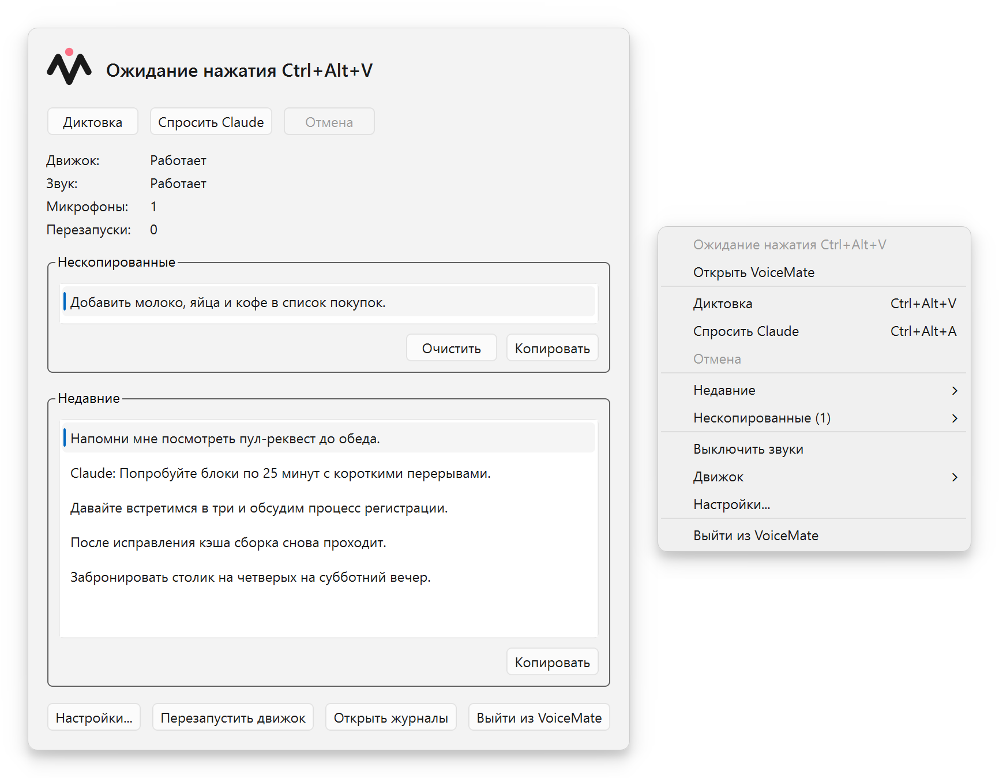
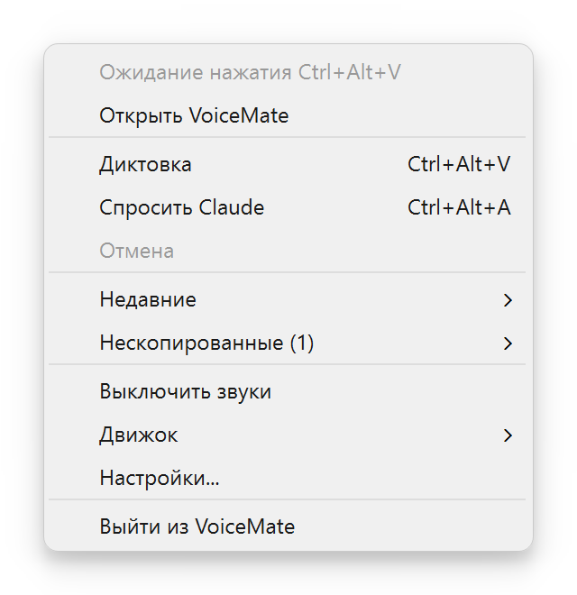
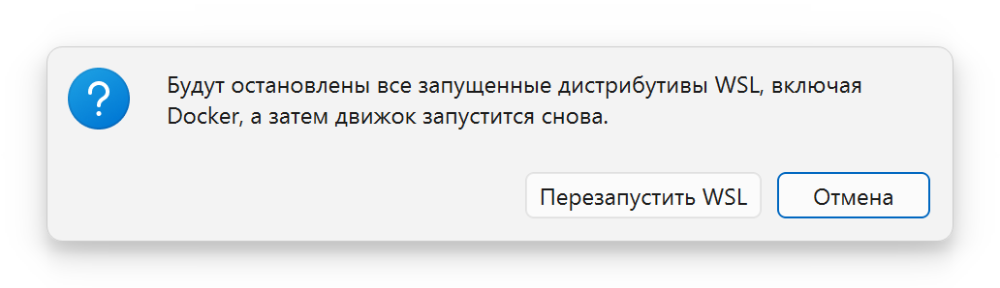
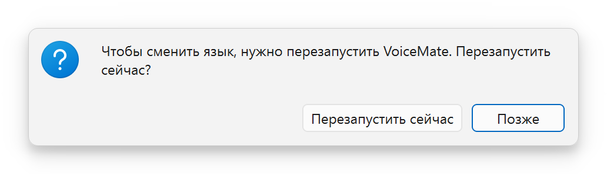
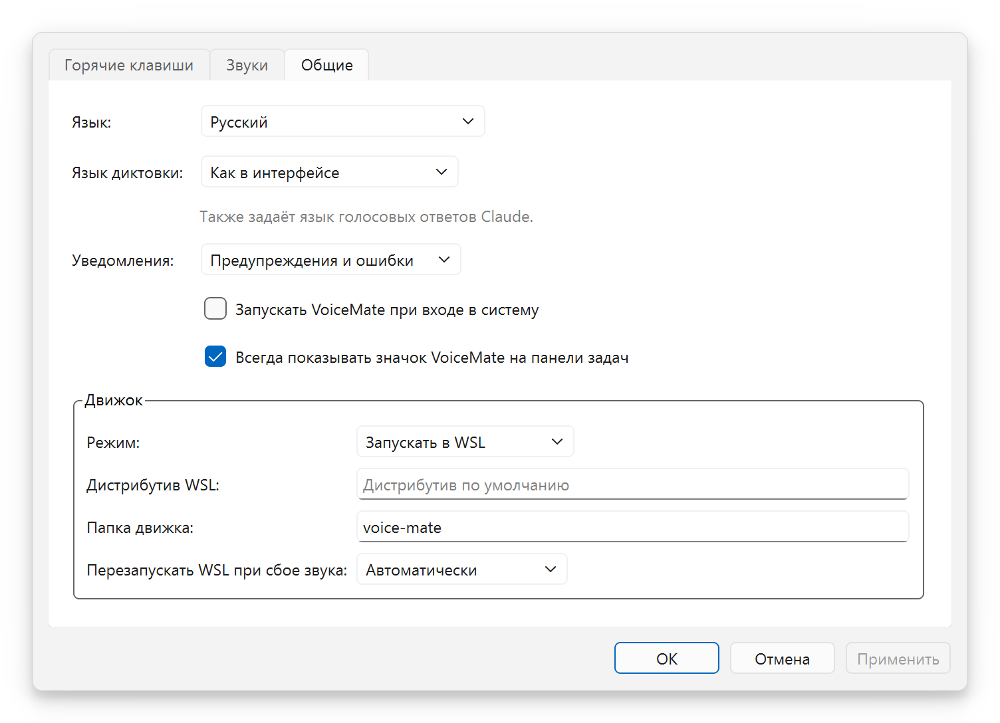
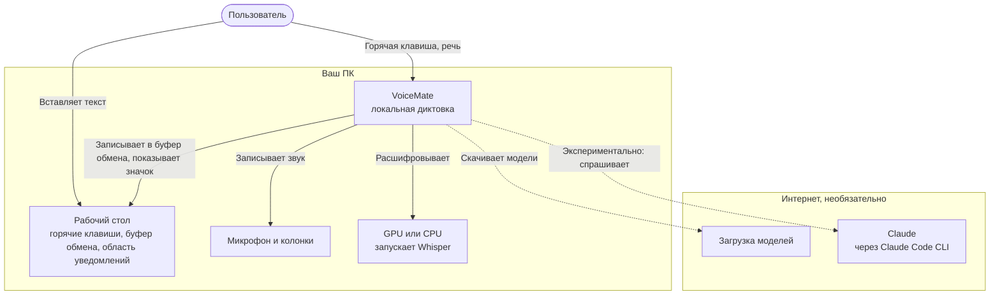
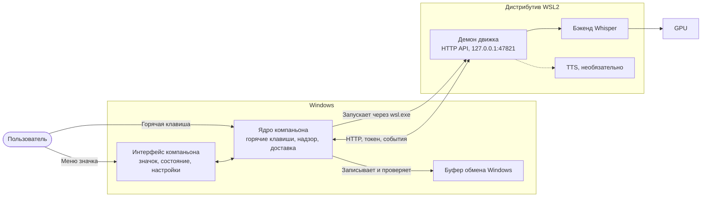
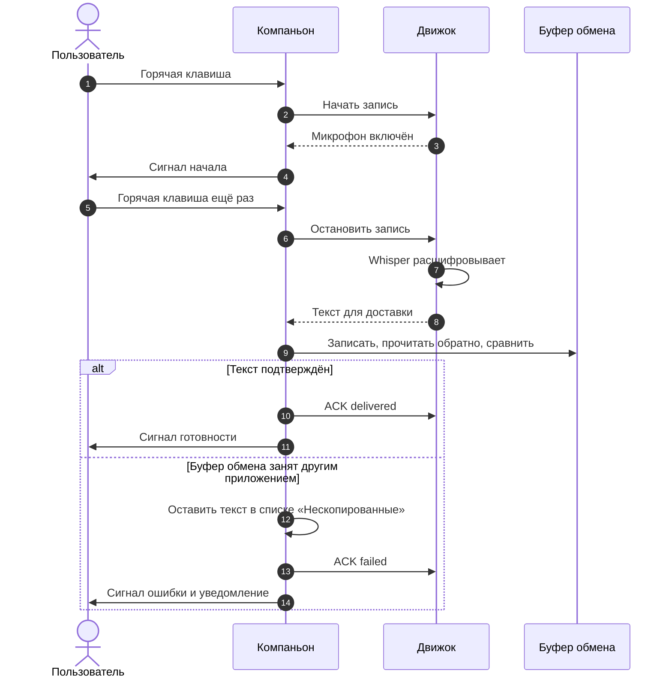
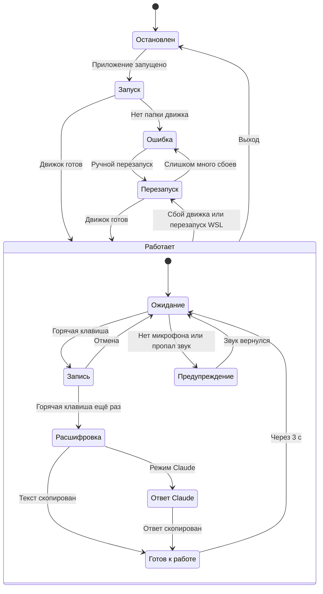
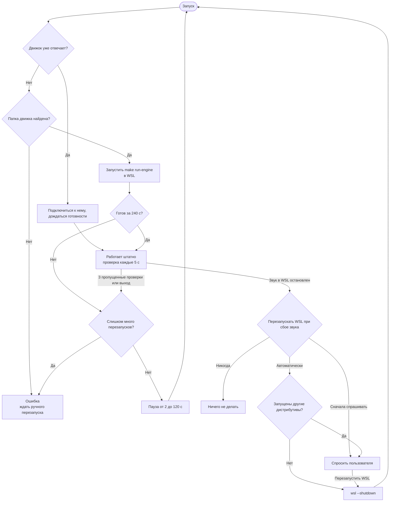

[English](README.md) | [Português](README.pt-BR.md) | [Español](README.es.md) | **Русский** | [简体中文](README.zh-CN.md)

<div align="center">

<picture>
  <source media="(prefers-color-scheme: dark)" srcset="docs/assets/brand/banner-dark.png">
  <source media="(prefers-color-scheme: light)" srcset="docs/assets/brand/banner-light.png">
  
</picture>

**Нажмите горячую клавишу, говорите, вставляйте. Локальная голосовая диктовка в буфер обмена на базе Whisper, который работает на вашем компьютере.**

[](https://github.com/nano-br/voice-mate/actions/workflows/ci.yml)
[](https://github.com/nano-br/voice-mate/releases/latest)
[](LICENSE)
[](pyproject.toml)
[-0078D6?style=flat)](#platforms-and-gpus)
[](#languages)

[Скачать](https://github.com/nano-br/voice-mate/releases/latest) · [Быстрый старт](#быстрый-старт) · [Документация](#документация) · [История изменений](CHANGELOG.md)



</div>

## Зачем нужен VoiceMate

VoiceMate появился из простой идеи, в которую я верю: чем быстрее и проще выразить мысль ИИ и чем больше подробностей ему дать, тем лучше результат. Говорить намного быстрее, чем печатать. Когда думаешь вслух, идея объясняется так, как её объясняют другому человеку, и контекста набирается гораздо больше, чем получилось бы набрать на клавиатуре.

VoiceMate мгновенно превращает речь в текст, готовый для любого ИИ-инструмента: промпта для помощника по коду, сообщения в чате, всего, что можно вставить. Нажмите горячую клавишу, говорите как обычно, нажмите её ещё раз и вставляйте. Whisper работает локально, поэтому звук остаётся на вашем компьютере. Для диктовки не нужны ни облачный сервис, ни оплата.

Основа VoiceMate: диктовка в буфер обмена. Я пользуюсь ею в реальной работе практически каждый рабочий день с марта 2026 года. Приложение создавалось и проверялось в боевых условиях на Windows с видеокартой NVIDIA. После перехода на видеокарту AMD VoiceMate получил поддержку AMD через WSL2 и Linux и теперь проверен и там. Этот путь пока **экспериментальный**.

Позже появился второй модуль: голосовой диалог с Claude. Вы говорите, Claude отвечает, а ответ зачитывается вслух синтезом речи (TTS). Модуль необязателен и **экспериментален**.

## Содержание

[Возможности](#возможности) · [Скриншоты](#скриншоты) · [Быстрый старт](#быстрый-старт) · [Использование](#использование) · [Конфигурация](#конфигурация) · [Архитектура](#архитектура) · [Решение проблем](#решение-проблем) · [Документация](#документация) · [Участие в проекте](#участие-в-проекте) · [Лицензия](#лицензия)

## Возможности

**Диктовка (основное)**
- Одна горячая клавиша начинает и останавливает запись (по умолчанию `Ctrl+Alt+V`). Текст попадает в буфер обмена, готовый к вставке.
- Локальные модели Whisper, по умолчанию `large-v3-turbo`. Звук не покидает ваш компьютер.
- Язык диктовки закреплён для стабильного результата, а английские технические термины внутри речи на других языках по-прежнему распознаются.
- Звуковые сигналы: начало записи, расшифровка, скопировано, предупреждение, ошибка. Запись сама останавливается через 10 минут (настраивается).

**Компаньон для Windows**
- Значок в области уведомлений, который показывает состояние с первого взгляда, окно состояния с недавними расшифровками и настройки горячих клавиш, звуковых сигналов, уведомлений, языка и движка.
- Проверяемая доставка в буфер обмена: приложение записывает текст, читает его обратно и сравнивает. Текст, который не удалось доставить в буфер обмена, остаётся в списке **Нескопированные**, даже после перезапуска.
- Компаньон сам следит за движком: запускает его внутри WSL2, перезапускает при сбое и перезапускает WSL, когда в нём пропадает звук.
- Установщик для текущего пользователя (без запроса прав администратора) на 5 языках.

<a id="languages"></a>**Языки**: компаньон, сообщения движка и установщик доступны на английском, бразильском португальском, испанском, русском и упрощённом китайском.

<a id="platforms-and-gpus"></a>**Платформы и GPU**
- Windows 10/11 с NVIDIA (CUDA): исходный путь, проверенный в боевых условиях. Движок запускается нативно из командной строки.
- **Экспериментально:** движок внутри WSL2 (конфигурация компаньона), GPU AMD (ROCm, Vulkan) в WSL2, Linux и Windows, а также Linux (X11, Wayland) с необязательным компаньоном.
- Запасной режим на CPU везде. `make setup` определяет платформу и GPU и устанавливает подходящую сборку PyTorch и бэкенд распознавания речи.

**Голосовой диалог с Claude (экспериментально)**
- `Ctrl+Alt+A` отправляет вашу речь Claude через Claude Code CLI (ваш собственный вход в аккаунт: расшифрованный текст уходит в Anthropic, звук нет). Ответ копируется в буфер обмена и зачитывается вслух.
- Движки TTS: OmniVoice (используется, если ничего не сохранено), Kokoro (его предлагает `make setup`) и VoxCPM2. Диалог продолжается от реплики к реплике; любая горячая клавиша прерывает ответ и начинает новую запись.

## Скриншоты

| Меню в области уведомлений | «Перезапустить WSL?» и «Перезапустить VoiceMate?» |
|:---:|:---:|
|  | <br> |

<p align="center"><br><sub>«Настройки VoiceMate», вкладка «Общие». Также: вкладки <a href="docs/assets/screenshots/ru/settings-hotkeys.png">«Горячие клавиши»</a> и <a href="docs/assets/screenshots/ru/settings-sounds.png">«Звуки»</a>.</sub></p>

<p align="center"><br><sub>Состояние показывает значок с бейджем. Что означает каждый бейдж: <a href="docs/usage.md#tray-icon-and-menu">Usage, tray icon and menu</a> (на английском).</sub></p>

## Быстрый старт

### Windows, с установщиком

В установщике только компаньон. Движок работает внутри дистрибутива WSL2, поэтому сначала настройте его (**экспериментально**; полное руководство в [docs/installation.md](docs/installation.md), на английском).

1. В PowerShell установите WSL2 с Ubuntu: `wsl --install -d Ubuntu-24.04`, затем откройте Ubuntu (если у вас уже был другой дистрибутив WSL, выполните ещё и `wsl --set-default Ubuntu-24.04` или позже задайте «Дистрибутив WSL:» в настройках). Внутри него установите аудиопакеты; Python 3.12 (в Ubuntu 24.04 он есть) и [Poetry](https://python-poetry.org/docs/#installation) должны быть в `PATH` и у login-оболочки:
   ```bash
   sudo apt install -y libportaudio2 libasound2-plugins pulseaudio-utils wl-clipboard git make
   ```
2. Клонируйте движок и запустите пошаговую настройку:
   ```bash
   git clone https://github.com/nano-br/voice-mate.git ~/voice-mate
   cd ~/voice-mate
   make setup    # если нужна только диктовка, на вопрос «Какой основной режим?» ответьте 1 (clipboard)
   make doctor   # каждая проверка должна показать галочку
   ```
   Компаньон ищет движок в `~/voice-mate` и ещё в нескольких обычных папках ([список](docs/installation.md#2-install-the-engine)); если он лежит в другом месте, задайте «Папка движка:» в настройках. С GPU AMD установите также драйвер AMD и ROCm для WSL ([docs/wsl2.md](docs/wsl2.md)).
3. Рекомендуется: всё ещё в `~/voice-mate` один раз выполните `make run` и остановите его через `Ctrl+C`, когда он загрузится. При самом первом запуске скачивается модель Whisper, а компаньон даёт запуску движка всего 240 секунд (после 3 неудачных запусков подряд по тайм-ауту он перестаёт пробовать), и при медленном соединении этого может не хватить.
4. Скачайте `VoiceMate-Setup-x.y.z.exe` со [страницы последнего релиза](https://github.com/nano-br/voice-mate/releases/latest) и запустите его. Установщик не подписан кодом, поэтому Windows SmartScreen может выдать предупреждение: выберите **Подробнее**, затем **Выполнить в любом случае**. Установка идёт только для вашего пользователя, без запроса прав администратора.
5. Запустите VoiceMate. Пока загружается модель, значок в области уведомлений показывает «Запуск движка...» (от 10 до 60 секунд после того, как модель скачана), затем «Ожидание нажатия Ctrl+Alt+V».
6. По желанию: закрепите приложение на панели задач. Откройте меню «Пуск», найдите VoiceMate, щёлкните по нему правой кнопкой мыши и выберите **Закрепить на панели задач**.

### Из исходников

Понадобятся Python 3.12, [Poetry](https://python-poetry.org/docs/#installation), GNU `make` (в Windows сначала установите его, например через Chocolatey или Scoop) и `git`.

```bash
git clone https://github.com/nano-br/voice-mate.git
cd voice-mate
make setup                           # определяет платформу и GPU, устанавливает PyTorch и выбранные вами модули
make doctor                          # проверяет микрофон, звук, горячие клавиши и GPU и для каждой проблемы выводит способ её исправить
make run ARGS="--output-lang en"     # запускает движок с его собственными горячими клавишами (нативно в Windows или в Linux)
```

**По умолчанию движок использует португальский** (`--output-lang pt-BR`): от этого зависят язык, который слышит Whisper, ответы Claude и сообщения движка. Передайте `--output-lang en` (или другой код), как выше; `--transcription-language` и `VOICEMATE_LANG` меняют только что-то одно из этого ([конфигурация](docs/configuration.md)). Компаньон передаёт эти флаги сам, см. [Использование](#использование).

Чтобы запустить компаньон из исходников в Windows с движком в WSL2: один раз выполните `make companion-venv`, затем `make run-tray`. В Linux выполните `make setup` и `make run`, как выше; для необязательного значка в области уведомлений и окна состояния выполните `poetry install --extras ui`, а затем `make run-tray` ([подробности](docs/installation.md#linux-experimental)).

## Использование

| Горячая клавиша | Пункт меню в области уведомлений | Что происходит |
|---|---|---|
| `Ctrl+Alt+V` | «Диктовка» | Речь превращается в текст, он копируется в буфер обмена |
| `Ctrl+Alt+A` | «Спросить Claude» | Речь уходит Claude, ответ копируется и зачитывается вслух (**экспериментально**) |

Нажмите `Ctrl+Alt+V`, говорите после сигнала начала записи, снова нажмите `Ctrl+Alt+V` и вставляйте через `Ctrl+V` где угодно. Куда пойдёт текст, определяет горячая клавиша, которой остановлена запись. Текст, который не удалось доставить в буфер обмена, ждёт в списке **Нескопированные** (меню в области уведомлений и окно состояния): один щелчок копирует его. Чтобы выйти, выберите **Выйти из VoiceMate** в меню в области уведомлений; движок, который компаньон не запускал, продолжает работать.

**Язык диктовки.** В Настройки > **Общие** пункт «Язык диктовки:» задаёт язык, на котором вы говорите. По умолчанию выбрано «Как в интерфейсе»; «Определять автоматически» позволяет Whisper определять язык каждой записи (Claude по-прежнему отвечает на языке интерфейса; с Kokoro лучше закрепить язык); либо выберите один язык. Компаньон передаёт его запускаемому движку как `--transcription-language` и `--output-lang`, а смена языка перезапускает движок. Движок, к которому компаньон только подключается (юнит systemd или запущенный вручную), сохраняет свои флаги.

Для голосового диалога с Claude нужны установленный и авторизованный Claude Code CLI и модуль `claude`, выбранный в `make setup`. См. [docs/usage.md](docs/usage.md#claude-flow-experimental).

## Конфигурация

| Что | Где |
|---|---|
| Настройки компаньона | Windows `%APPDATA%\VoiceMate\companion.toml`, Linux `~/.config/voicemate/companion.toml` |
| Выбор движка из `make setup`, токен API | `~/.config/voicemate/` (внутри WSL для компаньона; `%USERPROFILE%\.config\voicemate\` для движка, запущенного нативно в Windows) |
| HTTP API движка | `127.0.0.1:47821` |
| Журналы (`companion.log`, `engine.log`) | Windows `%LOCALAPPDATA%\VoiceMate\logs`, Linux `~/.local/state/voicemate/logs` |
| Список **Нескопированные** | `pending.json` рядом с папкой `logs` |

Все флаги движка, все ключи настроек и все переменные окружения: [docs/configuration.md](docs/configuration.md).

## Архитектура

VoiceMate состоит из двух частей. **Движок** записывает звук, расшифровывает его и обслуживает режим Claude; это демон на Python с локальным HTTP API. **Компаньон** представляет собой приложение на PySide6 для области уведомлений в Windows: оно владеет горячими клавишами и буфером обмена и следит за движком внутри WSL2. Движок можно запускать и отдельно, из командной строки. Диаграммы ниже представляют собой упрощённые обзоры; каждая ведёт к полной диаграмме в [docs/architecture.md](docs/architecture.md) (на английском), где есть также диаграммы компонентов, HTTP API и обоснование проектных решений.

<details>
<summary>Системный контекст (обзор)</summary>



Обзор. Полная диаграмма: [docs/architecture.md, System context](docs/architecture.md#1-system-context).

</details>

<details>
<summary>Контейнеры, Windows с WSL2 (обзор)</summary>



Обзор. Полная диаграмма: [docs/architecture.md, Containers](docs/architecture.md#2-containers).

</details>

<details>
<summary>Одна диктовка по шагам (обзор)</summary>



Обзор. Полная диаграмма: [docs/architecture.md, One dictation](docs/architecture.md#4-runtime-one-dictation).

</details>

<details>
<summary>Состояния значка (обзор)</summary>



Обзор. Полная диаграмма: [docs/architecture.md, Tray states](docs/architecture.md#5-tray-states).

</details>

<details>
<summary>Надзор за движком и восстановление звука в WSL (обзор)</summary>



Обзор. Полная диаграмма: [docs/architecture.md, Supervisor](docs/architecture.md#6-supervisor-on-windows-and-wsl2).

</details>

## Решение проблем

| Симптом | Что делать |
|---|---|
| «Запуск движка...» длится долго | Первый запуск скачивает модель, это может занять несколько минут (один раз выполните `make run` в WSL, см. [Быстрый старт](#windows-с-установщиком)). Следующие запуски занимают от 10 до 60 секунд. Откройте **Движок** > **Открыть журналы** и прочитайте `engine.log`. |
| «Папка движка не найдена» | Клонируйте движок в одну из [обычных папок](docs/installation.md#2-install-the-engine) или задайте «Папка движка:» в Настройки > **Общие**. |
| Горячая клавиша сообщает «Занято другим приложением» | Возможно, ещё работает старый скрипт горячих клавиш VoiceMate. Закройте его и удалите из `shell:startup` или выберите другие горячие клавиши. |
| «Звук в WSL остановлен» или «Нет микрофона» | Подключите микрофон. VoiceMate перезапускает WSL в соответствии с настройкой «Перезапускать WSL при сбое звука:»; чтобы сделать это вручную, выберите **Движок** > **Перезапустить WSL...**. |
| Текст не попал в буфер обмена | Он лежит в списке **Нескопированные** (меню в области уведомлений и окно состояния). Щёлкните по нему, чтобы скопировать снова. |
| Английская речь распознаётся неверно, или сообщения движка на португальском | Движок, запущенный вручную, по умолчанию использует португальский: добавьте `ARGS="--output-lang en"` к `make run`. |
| Что-то ещё на стороне движка | Выполните `make doctor` в папке движка. Он выводит способ исправления для каждой непройденной проверки. |

Другие проблемы и точные тексты сообщений: [docs/troubleshooting.md](docs/troubleshooting.md).

## Документация

Подробные документы (на английском):

- [Установка](docs/installation.md): все способы установки, обновление и удаление.
- [Использование](docs/usage.md): режимы, горячие клавиши, значок в области уведомлений, модели и параметры голоса.
- [Конфигурация](docs/configuration.md): флаги движка, файлы настроек, переменные окружения.
- [Решение проблем](docs/troubleshooting.md): `make doctor`, звук в WSL, журналы, известные сообщения.
- [Архитектура](docs/architecture.md): диаграммы и проектные решения.
- [WSL2 и AMD](docs/wsl2.md) (экспериментально), [Устройство компаньона](docs/companion-app.md), [Бренд](docs/brand.md), [Выпуск релизов](docs/releasing.md).

## Участие в проекте

Issue и pull request'ы приветствуются. Все команды разработки идут через Makefile: `make format lint test` для движка (Ruff и строгий mypy) и `make companion-lint companion-test` для компаньона. Каждая строка интерфейса существует на 5 языках через gettext. Коммиты следуют Conventional Commits и объясняют контекст. Сначала прочитайте [CONTRIBUTING.md](CONTRIBUTING.md).

## Благодарности

VoiceMate опирается на работу многих проектов: [Whisper](https://github.com/openai/whisper) от OpenAI, [faster-whisper](https://github.com/SYSTRAN/faster-whisper), [whisper.cpp](https://github.com/ggml-org/whisper.cpp), [CTranslate2-ROCm](https://github.com/arlo-phoenix/CTranslate2-rocm), [PySide6](https://doc.qt.io/qtforpython-6/), [OmniVoice](https://huggingface.co/k2-fsa/OmniVoice), [Kokoro](https://github.com/hexgrad/kokoro), [VoxCPM](https://github.com/OpenBMB/VoxCPM), [Claude Agent SDK](https://github.com/anthropics/claude-agent-sdk-python) вместе с [Claude Code](https://docs.claude.com/en/docs/claude-code), [Inno Setup](https://jrsoftware.org/isinfo.php) и [PyInstaller](https://pyinstaller.org/).

## Лицензия

[MIT](LICENSE) © Álli Terhorst. Часть [NanoBR](https://github.com/nano-br): утилиты с открытым исходным кодом для повседневной продуктивности.
