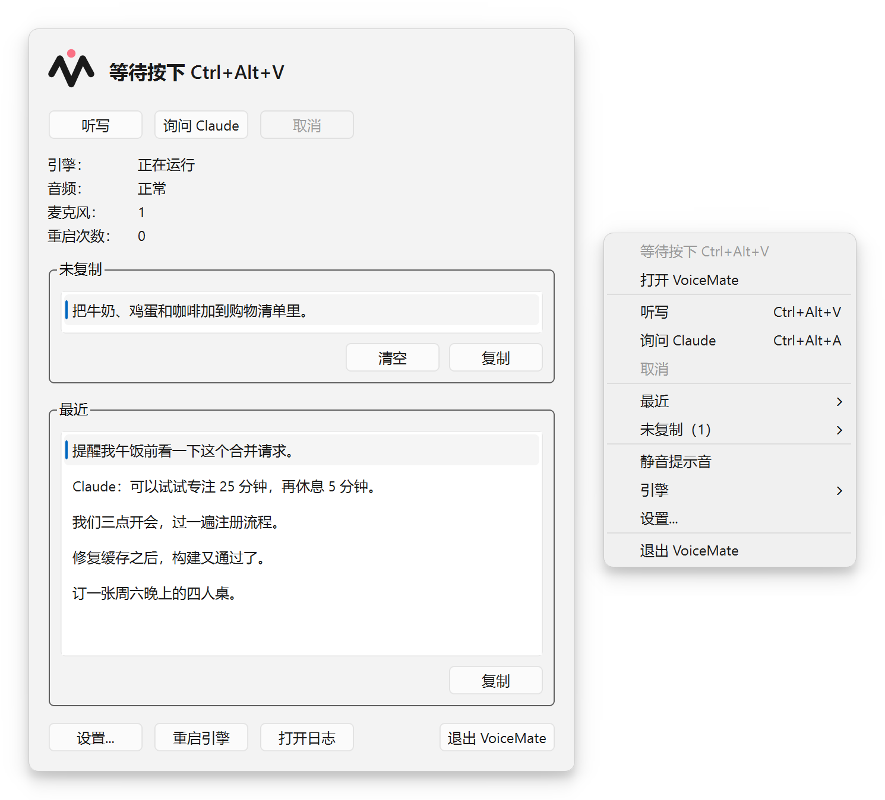
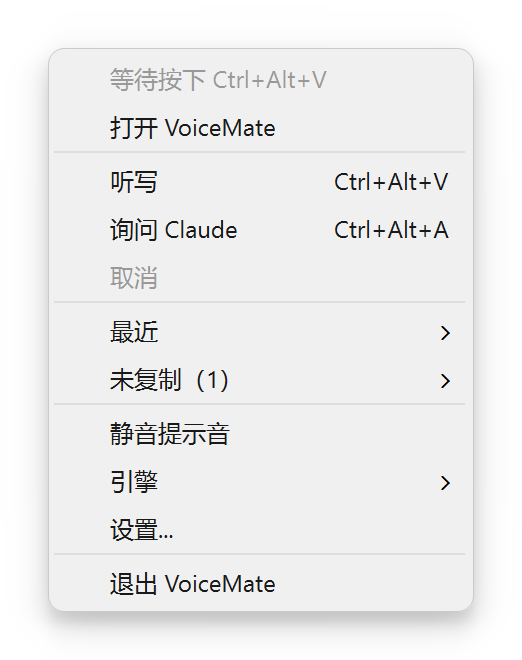
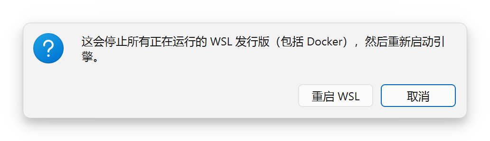
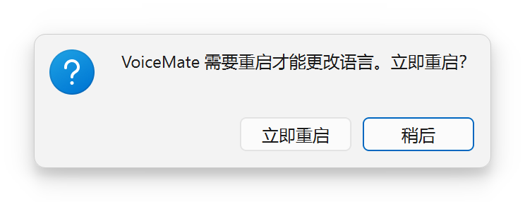
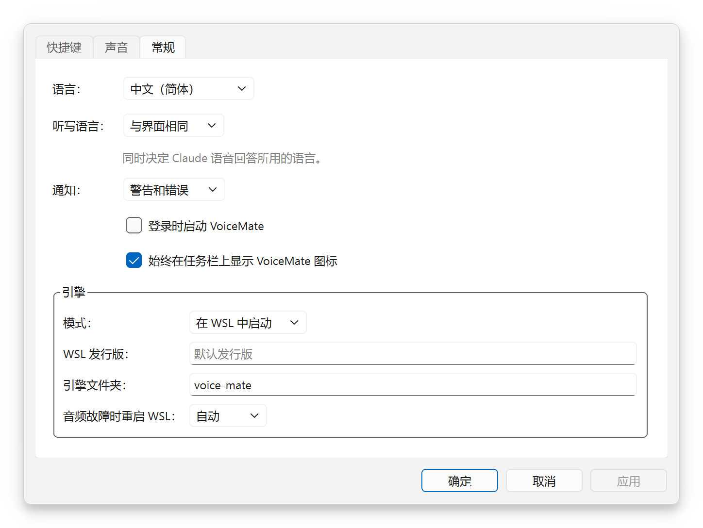
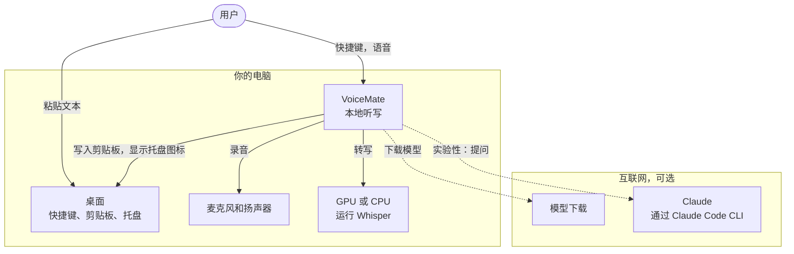
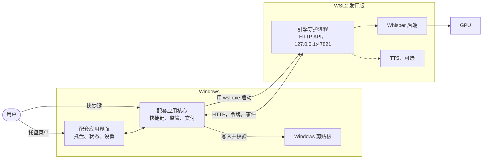
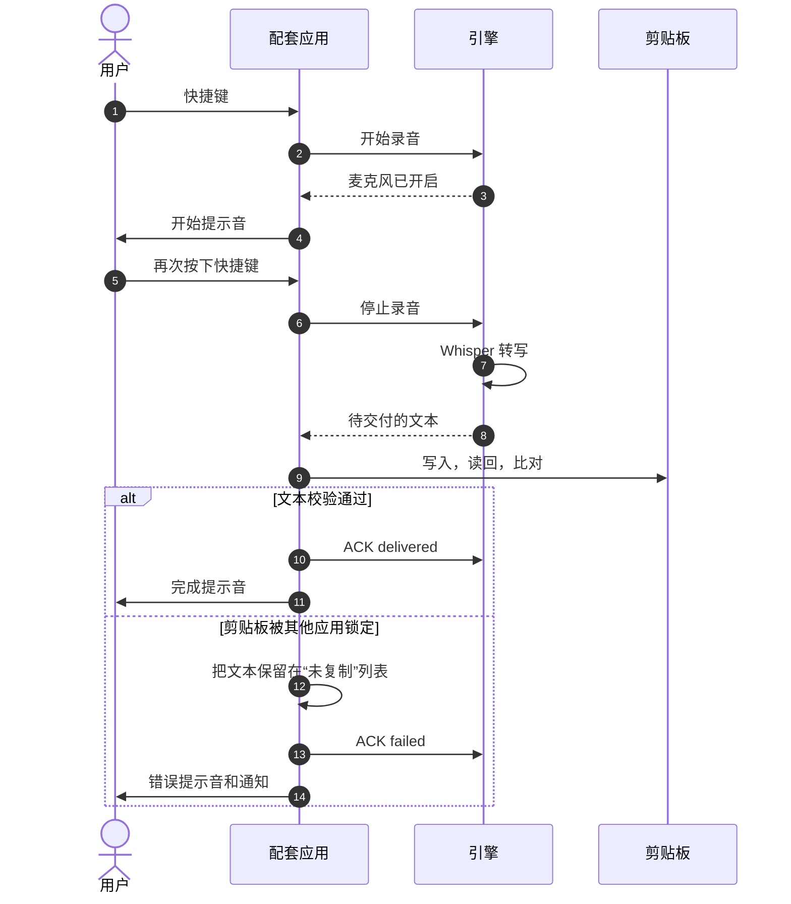
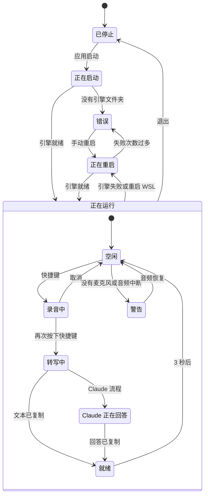
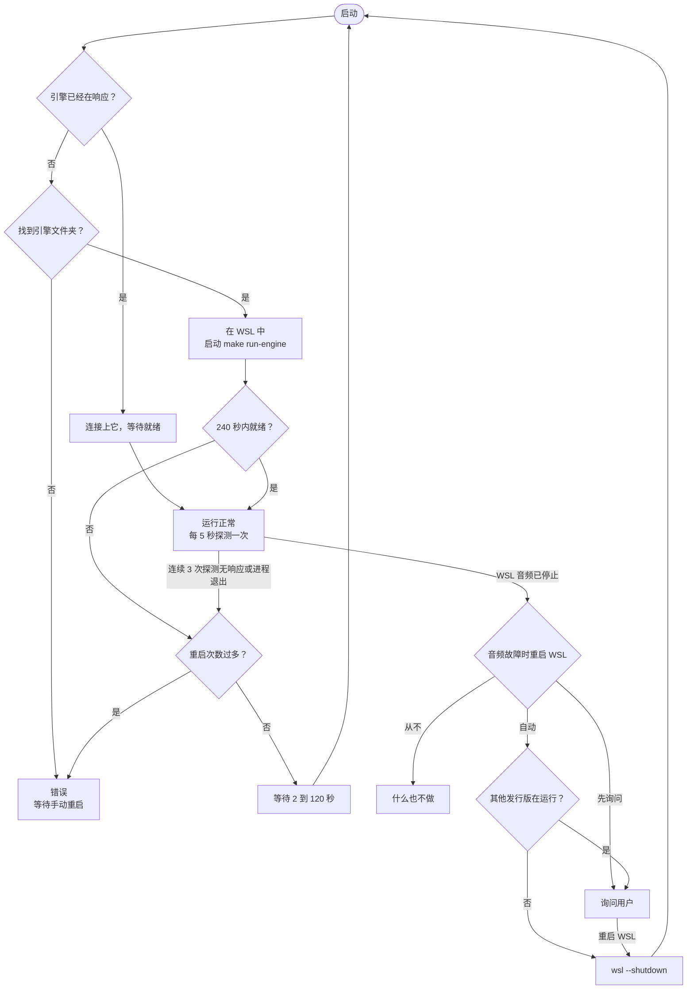

[English](README.md) | [Português](README.pt-BR.md) | [Español](README.es.md) | [Русский](README.ru.md) | **简体中文**

<div align="center">

<picture>
  <source media="(prefers-color-scheme: dark)" srcset="docs/assets/brand/banner-dark.png">
  <source media="(prefers-color-scheme: light)" srcset="docs/assets/brand/banner-light.png">
  
</picture>

**按下快捷键，说话，粘贴。本地语音听写直达剪贴板，由运行在你自己电脑上的 Whisper 驱动。**

[](https://github.com/nano-br/voice-mate/actions/workflows/ci.yml)
[](https://github.com/nano-br/voice-mate/releases/latest)
[](LICENSE)
[](pyproject.toml)
[-0078D6?style=flat)](#platforms-and-gpus)
[](#languages)

[下载](https://github.com/nano-br/voice-mate/releases/latest) · [快速开始](#快速开始) · [文档](#文档) · [更新日志](CHANGELOG.md)



</div>

## 为什么做 VoiceMate

我做 VoiceMate，是因为我相信一件很简单的事：向 AI 表达想法越快、越轻松，给出的细节越多，得到的结果就越好。说话比打字快得多。边想边说的时候，你会像向另一个人解释那样把想法讲清楚，带出的上下文远比你愿意敲出来的多。

VoiceMate 能立刻把语音变成文字，随时交给任何 AI 工具：给编程助手的提示词、聊天工具里的一条消息，任何可以粘贴的地方都行。按下快捷键，自然地说话，再按一次，然后粘贴。Whisper 在本地运行，所以你的音频只留在自己的电脑上。听写不需要云服务，也不需要付费。

听写到剪贴板是 VoiceMate 的核心。从 2026 年 3 月起，我几乎每个工作日都在真实的工作中使用它。它最初在搭载 NVIDIA 显卡的 Windows 上开发，并经过了实战检验。后来我把显卡换成了 AMD，于是通过 WSL2 和 Linux 把 VoiceMate 适配到了 AMD，现在这条路径也经过了测试。这条路径目前仍是**实验性**的。

后来加入了第二个模块：与 Claude 的语音对话。你说话，Claude 回答，回答再由文字转语音（TTS）朗读出来。这个模块是可选的，也是**实验性**的。

## 目录

[功能](#功能) · [截图](#截图) · [快速开始](#快速开始) · [使用](#使用) · [配置](#配置) · [架构](#架构) · [故障排查](#故障排查) · [文档](#文档) · [参与贡献](#参与贡献) · [许可证](#许可证)

## 功能

**听写（核心）**
- 一个快捷键即可开始和停止录音（默认 `Ctrl+Alt+V`）。文本进入剪贴板，随时可以粘贴。
- 本地 Whisper 模型，默认 `large-v3-turbo`。音频不会离开你的电脑。
- 听写语言是固定指定的，以保证结果稳定；在其他语言中夹杂的英文技术术语也依然能被转写。
- 开始、转写、已复制、警告和错误都有各自的提示音。录音在 10 分钟后自动停止（可配置）。

**Windows 配套应用**
- 托盘图标让你一眼看清当前状态，状态窗口列出最近的转写，设置中可以调整快捷键、提示音、通知、语言和引擎。
- 经过验证的剪贴板交付：应用写入文本，再读回来进行比对。无法进入剪贴板的文本会保留在“未复制”列表中，即使重启后也不会丢失。
- 配套应用会自己照看引擎：在 WSL2 内启动引擎，引擎失败时重启它，WSL 的音频中断时重启 WSL。
- 按用户安装的安装程序（不会弹出管理员权限提示），提供 5 种语言。

<a id="languages"></a>**语言**：配套应用、引擎消息和安装程序支持英语、巴西葡萄牙语、西班牙语、俄语和简体中文。

<a id="platforms-and-gpus"></a>**平台与 GPU**
- Windows 10/11 搭配 NVIDIA（CUDA）：最初的路径，经过实战检验。引擎可以在命令行中原生运行。
- **实验性：** 引擎运行在 WSL2 内（配套应用的部署方式），WSL2、Linux 和 Windows 上的 AMD GPU（ROCm、Vulkan），以及搭配可选配套应用的 Linux（X11、Wayland）。
- 各平台都可以回退到 CPU。`make setup` 会检测平台和 GPU，并安装匹配的 PyTorch 版本和语音转文字后端。

**与 Claude 的语音对话（实验性）**
- `Ctrl+Alt+A` 通过 Claude Code CLI 把你的语音发送给 Claude（使用你自己的登录账号：转写后的文本会发送给 Anthropic，音频不会）。回答会复制到剪贴板并朗读出来。
- TTS 引擎：OmniVoice（没有保存任何选择时使用的引擎）、Kokoro（`make setup` 推荐的引擎）和 VoxCPM2。对话可以跨轮次继续；按下任何快捷键都会打断回答并开始新的录音。

## 截图

| 托盘菜单 | “重启 WSL？”和“重启 VoiceMate？” |
|:---:|:---:|
|  | <br> |

<p align="center"><br><sub>“VoiceMate 设置”，“常规”选项卡。另见：<a href="docs/assets/screenshots/zh-CN/settings-hotkeys.png">“快捷键”</a>和<a href="docs/assets/screenshots/zh-CN/settings-sounds.png">“声音”</a>选项卡。</sub></p>

<p align="center"><br><sub>托盘图标用角标显示状态。每个角标的含义：<a href="docs/usage.md#tray-icon-and-menu">Usage, tray icon and menu</a>（英文）。</sub></p>

## 快速开始

### Windows，使用安装程序

安装程序只包含配套应用。引擎运行在 WSL2 发行版内，所以请先把它准备好（**实验性**；完整指南见 [docs/installation.md](docs/installation.md)，英文）。

1. 在 PowerShell 中安装带 Ubuntu 的 WSL2：`wsl --install -d Ubuntu-24.04`，然后打开 Ubuntu（如果你原来就有别的 WSL 发行版，还要运行 `wsl --set-default Ubuntu-24.04`，或者稍后在设置中指定“WSL 发行版：”）。在 Ubuntu 里安装音频相关的包；Python 3.12（Ubuntu 24.04 自带）和 [Poetry](https://python-poetry.org/docs/#installation) 也必须在登录 shell 的 `PATH` 中：
   ```bash
   sudo apt install -y libportaudio2 libasound2-plugins pulseaudio-utils wl-clipboard git make
   ```
2. 克隆引擎并运行引导式安装：
   ```bash
   git clone https://github.com/nano-br/voice-mate.git ~/voice-mate
   cd ~/voice-mate
   make setup    # 只需要听写时，在“选择哪个主流程？”处回答 1（clipboard）
   make doctor   # 每一项检查都应显示对勾
   ```
   配套应用会在 `~/voice-mate` 和其他几个常用文件夹中查找引擎（[列表](docs/installation.md#2-install-the-engine)）；如果放在别处，请在设置中指定“引擎文件夹：”。使用 AMD GPU 时，还要安装 AMD 驱动和适用于 WSL 的 ROCm（[docs/wsl2.md](docs/wsl2.md)）。
3. 推荐：仍在 `~/voice-mate` 中，运行一次 `make run`，加载完成后按 `Ctrl+C` 停止。第一次启动时会下载 Whisper 模型，而配套应用只给引擎启动 240 秒（连续 3 次启动超时后就不再重试），网速慢的话可能不够用。
4. 从[最新发布版](https://github.com/nano-br/voice-mate/releases/latest)下载 `VoiceMate-Setup-x.y.z.exe` 并运行。安装程序没有代码签名，所以 Windows SmartScreen 可能会发出警告：选择 **更多信息**，然后选择 **仍要运行**。它只为当前用户安装，不会弹出管理员权限提示。
5. 启动 VoiceMate。模型加载期间托盘显示“正在启动引擎...”（模型下载完成后需要 10 到 60 秒），然后显示“等待按下 Ctrl+Alt+V”。
6. 可选：固定到任务栏。打开“开始”菜单，搜索 VoiceMate，右键单击它并选择 **固定到任务栏**。

### 从源码安装

你需要 Python 3.12、[Poetry](https://python-poetry.org/docs/#installation)、GNU `make`（在 Windows 上要先安装，例如通过 Chocolatey 或 Scoop）和 `git`。

```bash
git clone https://github.com/nano-br/voice-mate.git
cd voice-mate
make setup                           # 检测平台和 GPU，安装 PyTorch 和你选择的模块
make doctor                          # 检查麦克风、音频、快捷键和 GPU，并为每个问题给出修复方法
make run ARGS="--output-lang en"     # 用引擎自带的快捷键启动引擎（Windows 原生或 Linux）
```

**引擎默认使用葡萄牙语**（`--output-lang pt-BR`），它决定 Whisper 听的语言、Claude 回答的语言和引擎消息的语言。请像上面那样传入 `--output-lang en`（或其他语言代码）；`--transcription-language` 和 `VOICEMATE_LANG` 只会改变其中一项（[配置](docs/configuration.md)）。配套应用会自己传入这些参数，参见[使用](#使用)。

在 Windows 上从源码运行配套应用（引擎在 WSL2 中）：先运行一次 `make companion-venv`，然后运行 `make run-tray`。在 Linux 上，像上面那样运行 `make setup` 和 `make run`；如需可选的托盘和状态窗口，运行 `poetry install --extras ui`，然后运行 `make run-tray`（[详情](docs/installation.md#linux-experimental)）。

## 使用

| 快捷键 | 托盘菜单项 | 效果 |
|---|---|---|
| `Ctrl+Alt+V` | “听写” | 语音转为文本，复制到剪贴板 |
| `Ctrl+Alt+A` | “询问 Claude” | 语音发送给 Claude，回答被复制并朗读出来（**实验性**） |

按下 `Ctrl+Alt+V`，在开始提示音之后说话，再按一次 `Ctrl+Alt+V`，然后在任何地方用 `Ctrl+V` 粘贴。文本的去向由用来停止录音的那个快捷键决定。无法进入剪贴板的文本会留在 **未复制** 列表中（托盘菜单和状态窗口里都有），单击一下就能复制。要退出，请在托盘菜单中选择 **退出 VoiceMate**；不是由配套应用启动的引擎会继续运行。

**听写语言。** 在设置 > **常规** 中，“听写语言：”决定你说话的语言。默认是“与界面相同”；选择“自动检测”则让 Whisper 检测每一段录音的语言（Claude 仍然用界面语言回答；使用 Kokoro 时，请改为固定一种语言）；也可以只选一种语言。配套应用会把它以 `--transcription-language` 和 `--output-lang` 的形式传给它启动的引擎，更改后会重启引擎。配套应用只是连接上的引擎（systemd 单元，或手动启动的引擎）则保留它自己的参数。

与 Claude 的语音对话需要安装并登录 Claude Code CLI，并且在 `make setup` 中选择了 `claude` 模块。参见 [docs/usage.md](docs/usage.md#claude-flow-experimental)。

## 配置

| 内容 | 位置 |
|---|---|
| 配套应用设置 | Windows `%APPDATA%\VoiceMate\companion.toml`，Linux `~/.config/voicemate/companion.toml` |
| `make setup` 中的引擎选择、API 令牌 | `~/.config/voicemate/`（对配套应用来说在 WSL 内；对在 Windows 上原生运行的引擎则是 `%USERPROFILE%\.config\voicemate\`） |
| 引擎 HTTP API | `127.0.0.1:47821` |
| 日志（`companion.log`、`engine.log`） | Windows `%LOCALAPPDATA%\VoiceMate\logs`，Linux `~/.local/state/voicemate/logs` |
| **未复制** 列表 | `logs` 文件夹旁边的 `pending.json` |

所有引擎参数、所有设置项和所有环境变量：[docs/configuration.md](docs/configuration.md)。

## 架构

VoiceMate 由两部分组成。**引擎**负责录音、转写并运行 Claude 流程；它是一个带本地 HTTP API 的 Python 守护进程。**配套应用**是 Windows 上基于 PySide6 的托盘应用，掌管快捷键和剪贴板，并在 WSL2 内照看引擎。引擎也可以脱离配套应用，单独从命令行运行。下面的图都是简化的概览；每张图都链接到 [docs/architecture.md](docs/architecture.md)（英文）中的完整图，那里还有组件图、HTTP API 和设计取舍。

<details>
<summary>系统上下文（概览）</summary>



概览。完整的图：[docs/architecture.md, System context](docs/architecture.md#1-system-context)。

</details>

<details>
<summary>容器，Windows 与 WSL2（概览）</summary>



概览。完整的图：[docs/architecture.md, Containers](docs/architecture.md#2-containers)。

</details>

<details>
<summary>一次听写，逐步说明（概览）</summary>



概览。完整的图：[docs/architecture.md, One dictation](docs/architecture.md#4-runtime-one-dictation)。

</details>

<details>
<summary>托盘状态（概览）</summary>



概览。完整的图：[docs/architecture.md, Tray states](docs/architecture.md#5-tray-states)。

</details>

<details>
<summary>引擎监管与 WSL 音频恢复（概览）</summary>



概览。完整的图：[docs/architecture.md, Supervisor](docs/architecture.md#6-supervisor-on-windows-and-wsl2)。

</details>

## 故障排查

| 现象 | 怎么办 |
|---|---|
| “正在启动引擎...”持续很久 | 第一次启动要下载模型，可能需要几分钟（先在 WSL 中运行一次 `make run`，参见[快速开始](#windows使用安装程序)）。之后每次启动需要 10 到 60 秒。打开 **引擎** > **打开日志**，查看 `engine.log`。 |
| “未找到引擎文件夹” | 把引擎克隆到[常用文件夹](docs/installation.md#2-install-the-engine)之一，或者在设置 > **常规** 中指定“引擎文件夹：”。 |
| 某个快捷键提示“已被其他应用占用” | 可能还有旧的 VoiceMate 快捷键脚本在运行。关闭它并从 `shell:startup` 中删除，或者选择其他快捷键。 |
| “WSL 音频已停止”或“没有麦克风” | 请连接麦克风。VoiceMate 会按“音频故障时重启 WSL：”的设置重启 WSL；想手动重启，请使用 **引擎** > **重启 WSL...**。 |
| 文本没有进入剪贴板 | 它在 **未复制** 列表中（托盘菜单和状态窗口里都有）。单击它即可再次复制。 |
| 英语语音识别结果不对，或者引擎消息是葡萄牙语 | 手动启动的引擎默认使用葡萄牙语：给 `make run` 加上 `ARGS="--output-lang en"`。 |
| 引擎一侧的其他问题 | 在引擎文件夹中运行 `make doctor`。每一项未通过的检查它都会给出修复方法。 |

更多问题和确切的消息文本：[docs/troubleshooting.md](docs/troubleshooting.md)。

## 文档

详细文档（英文）：

- [安装](docs/installation.md)：所有安装方式、更新和卸载。
- [使用](docs/usage.md)：流程、快捷键、托盘图标、模型和语音选项。
- [配置](docs/configuration.md)：引擎参数、设置文件、环境变量。
- [故障排查](docs/troubleshooting.md)：`make doctor`、WSL 音频、日志、已知消息。
- [架构](docs/architecture.md)：图表和设计取舍。
- [WSL2 与 AMD](docs/wsl2.md)（实验性）、[配套应用设计](docs/companion-app.md)、[品牌](docs/brand.md)、[发布流程](docs/releasing.md)。

## 参与贡献

欢迎提交 issue 和 pull request。所有开发命令都通过 Makefile 运行：引擎用 `make format lint test`（Ruff 和严格模式的 mypy），配套应用用 `make companion-lint companion-test`。每一条面向用户的字符串都通过 gettext 提供 5 种语言。提交遵循 Conventional Commits，并说明背景。请先阅读 [CONTRIBUTING.md](CONTRIBUTING.md)。

## 致谢

VoiceMate 建立在许多项目的成果之上：OpenAI 的 [Whisper](https://github.com/openai/whisper)、[faster-whisper](https://github.com/SYSTRAN/faster-whisper)、[whisper.cpp](https://github.com/ggml-org/whisper.cpp)、[CTranslate2-ROCm](https://github.com/arlo-phoenix/CTranslate2-rocm)、[PySide6](https://doc.qt.io/qtforpython-6/)、[OmniVoice](https://huggingface.co/k2-fsa/OmniVoice)、[Kokoro](https://github.com/hexgrad/kokoro)、[VoxCPM](https://github.com/OpenBMB/VoxCPM)、[Claude Agent SDK](https://github.com/anthropics/claude-agent-sdk-python) 与 [Claude Code](https://docs.claude.com/en/docs/claude-code)、[Inno Setup](https://jrsoftware.org/isinfo.php) 以及 [PyInstaller](https://pyinstaller.org/)。

## 许可证

[MIT](LICENSE) © Álli Terhorst。属于 [NanoBR](https://github.com/nano-br)：服务于日常效率的开源工具。
