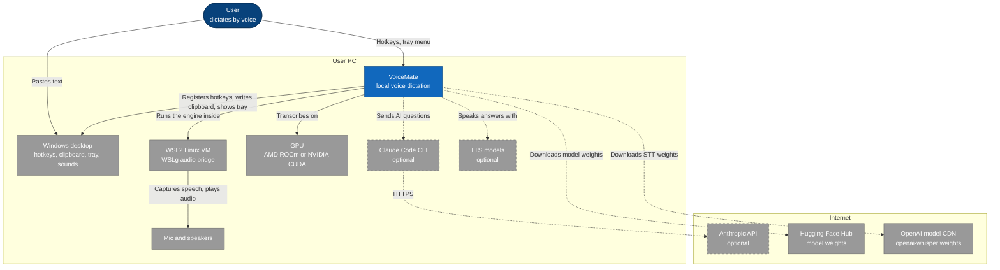
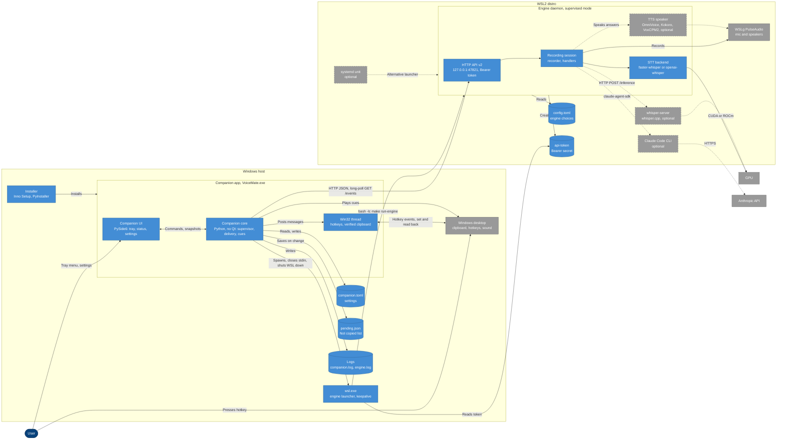
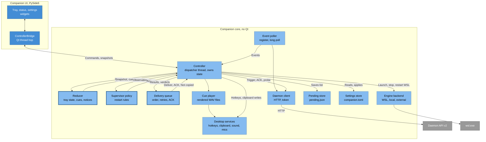
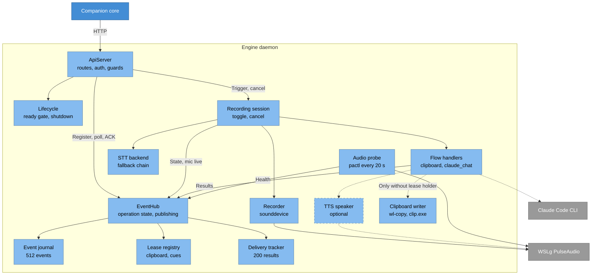
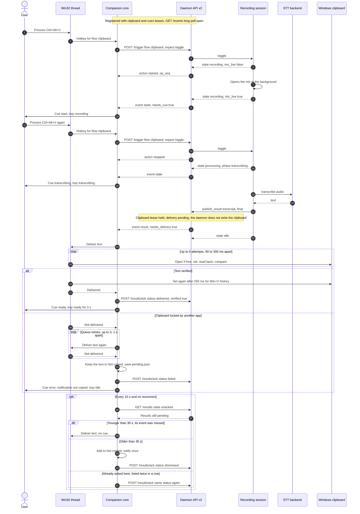
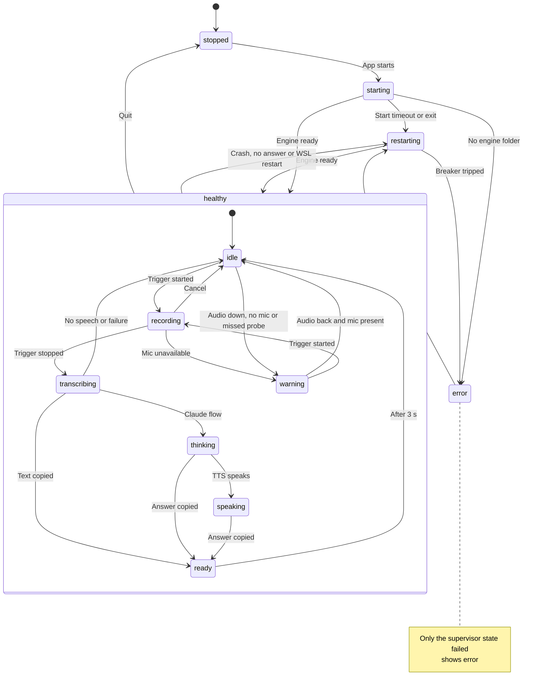
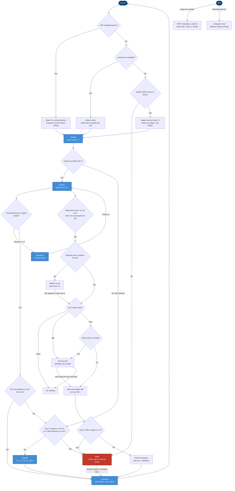

# Architecture

Purpose: how VoiceMate is built, with the diagrams of every level, the HTTP API, the package tree and the reasons behind the main design choices. Back to the [README](../README.md).

This page describes the Windows + WSL2 setup (companion app on Windows, engine inside WSL2), the setup the companion was built for. The Linux `local` mode and the command-line mode are mentioned where they differ. When the code changes, this page changes in the same pull request. The protocol contract in full detail is in [companion-app.md](companion-app.md).

## 1. System context



The user presses a global hotkey on Windows and pastes the text wherever the cursor is. VoiceMate is a local system split across the two halves of the same PC. The Windows desktop provides the hotkeys, the clipboard, the tray and the sound output for the cues. The engine runs inside the WSL2 Linux VM because there an AMD GPU is reachable through ROCm ([wsl2.md](wsl2.md)). Microphone and speakers reach the engine through the WSLg PulseAudio bridge, which the engine probes with `pactl info` every 20 seconds (`app/platform/audio_probe.py`).

Everything optional sits behind dashed arrows. The Claude flow runs the local Claude Code CLI through `claude-agent-sdk` (`app/features/claude/runtime.py`), which calls the Anthropic API (default model `claude-haiku-4-5`). The TTS libraries speak the answer (default engine `omnivoice`). Model weights come from the internet on first use:

| What | Source | When |
|---|---|---|
| whisper.cpp GGML model, its q8 variant, Silero VAD for whisper.cpp | Hugging Face (`ggerganov/whisper.cpp`, `ggml-org/whisper-vad`) | `make setup` or `make configure` |
| faster-whisper model (`large-v3-turbo` by default) | Hugging Face, through the `faster-whisper` library | First model load |
| openai-whisper model (the usual backend on WSL2 + AMD without CTranslate2-ROCm) | OpenAI's model CDN, through the `openai-whisper` library | First model load |
| OmniVoice, VoxCPM2 and Kokoro weights | Hugging Face (`k2-fsa/OmniVoice`, `openbmb/VoxCPM2`, Kokoro through its library) | First TTS load |
| PyTorch ROCm wheels, whisper.cpp sources, the CTranslate2-ROCm fork | `repo.radeon.com`, GitHub | `make setup` |

## 2. Containers



Two hosts, one loopback contract. On Windows, the companion (`VoiceMate.exe`, installed per user by Inno Setup into `%LOCALAPPDATA%\Programs\VoiceMate`) is split into a Qt-free **core** and a PySide6 **UI**. The UI only renders immutable `CompanionSnapshot` objects and calls `CompanionController` commands (`app/companion/contract.py`). A test forbids the companion from importing the engine stack (`tests/test_import_boundary.py`).

Inside the core, one dedicated **Win32 thread** owns `RegisterHotKey` and every clipboard write and read-back (`app/companion/win/hotkeys_clipboard.py`). The core starts the engine with `wsl.exe -d <distro> -e bash -lc 'cd ... && exec make run-engine ARGS="--daemon-port <port>"'`, inside a Job Object, with stdin held open and the output drained into `engine.log` (`app/companion/supervisor/wsl.py`, `app/companion/supervisor/backend.py`). `make run-engine` is `voice-mate --supervised --api --api-token`.

Inside WSL2 the **engine daemon** binds its HTTP API on `127.0.0.1:47821` BEFORE it loads the model, creates the token file `~/.config/voicemate/api-token` and starts the stdin end-of-file watcher (`app/main.py`). WSL2 forwards that port to the Windows loopback. The core reads the token through `wsl.exe ... cat` (`app/companion/supervisor/wsl.py`) and talks plain HTTP JSON with `urllib`, without the system proxy, with a 25 second long poll on `GET /events` (`app/companion/client.py`).

Speech-to-text and TTS run in the daemon process. Only whisper.cpp in server mode (`whisper-server` on a free loopback port) and the Claude Code CLI (started by `claude-agent-sdk`) are separate processes. Local state on Windows: `companion.toml` in `%APPDATA%\VoiceMate`, `pending.json` and `logs\` in `%LOCALAPPDATA%\VoiceMate` (`app/companion/paths.py`). An optional systemd user service can run the daemon instead; the companion then attaches to it.

### HTTP API v2

Routes in `app/daemon/server.py`, payloads in `app/protocol/models.py`:

| Route | Purpose |
|---|---|
| `GET /health` | Readiness, `api_version`, `instance`, `audio`, `flow_info`. Never needs the token |
| `POST /register`, `POST /unregister` | Client id, exclusive leases `clipboard` and `cues` (10 to 120 seconds, default 40), snapshot and cursor |
| `GET /events?client_id&instance&since&wait` | Long poll (at most 25 seconds) over a ring of 512 events: `snapshot`, `state`, `result`, `error`, `warning`, `health`, `shutdown` |
| `POST /trigger` (`expect`: toggle, start, stop), `POST /cancel` | Drive the recording session |
| `POST /results/ack`, `GET /results?state=unacked` or `recent` | Delivery ACK and reconciliation over the last 200 results |
| `POST /shutdown` | Graceful stop, reason `user_quit`, `restart` or `supervisor` |

The v1 routes of the old Windows scripts (`/status`, `/result`, `/register` with an empty body, `POST /trigger`) still work against a daemon without a token. Guards on every request: `403` for any `Origin` header or a non-loopback `Host`, `401` without the bearer token (except `/health`), `503` until ready (except `/health`, `/shutdown`, `/unregister`).

## 3. Components

### 3.1 Companion core



The core is built as pure state machines driven by one thread. The `Dispatcher` thread owns the only `CoreState` and runs posted tasks and timers in order (`app/companion/runtime.py`). Slow work goes to serial executors (I/O, commands, supervisor, prober, pending writer) whose results are posted back (`app/companion/controller.py`).

Three pure modules hold the rules and do no I/O: the **reducer** (`app/companion/model.py`), the **supervisor policy** (`app/companion/supervisor/policy.py`) and the **delivery queue** (`app/companion/delivery.py`). Each returns effects or actions that the controller executes. The `EventPoller` thread registers, long-polls `/events` and registers again on `410`, on an instance change or on a lost lease (`app/companion/client.py`). Engine hosts are pluggable: `WslBackend`, `LocalBackend`, `ExternalBackend`. OS services sit behind the `Desktop` bundle: hotkeys, clipboard, sound, the capture device count (Core Audio on Windows), autostart and tray promotion (`app/companion/desktop.py`). The UI reaches the core only through `ControllerBridge`, which moves every callback to the Qt thread (`app/companion/ui/bridge.py`).

### 3.2 Engine daemon



`ApiServer` only translates HTTP into calls on `EventHub`, the single owner of the API v2 state (`app/daemon/server.py`, `app/daemon/hub.py`). The hub keeps the current operation, appends typed events to the `EventJournal` (a ring of 512), tracks results in the `DeliveryTracker` (the last 200, aged on the daemon's monotonic clock) and consults the `LeaseRegistry`. Lease decisions are taken once per publication under the hub lock: the same holder snapshot sets the per-client `needs_cue` and `needs_delivery` flags and tells the engine whether to write the clipboard or beep itself. `Lifecycle` holds the readiness gate and the single shutdown request (`app/daemon/lifecycle.py`).

`RecordingSession` runs the operation: it publishes `recording` before it opens the microphone, sets `mic_live` when the stream is really open, and transcribes on its own thread, waiting for the warmup the first time (`app/core/recording_session.py`). Handlers per flow: `ClipboardHandler` publishes the transcript and writes the clipboard itself only when nobody holds the lease (through `wl-copy`, then `pyperclip`, then `clip.exe` on WSL2; `app/core/transcription_handler.py`, `app/platform/clipboard.py`). `ClaudeChatHandler` adds the `thinking` and `speaking` phases. The speech-to-text backend is chosen once at start by a fallback chain (`app/cli/wiring.py`); on WSL2 + AMD: CTranslate2-ROCm faster-whisper if validated, then openai-whisper, then whisper.cpp, then CPU. `AudioServerProbe` publishes `health` events when WSLg PulseAudio changes state.

## 4. Runtime: one dictation



The companion, not the engine, owns the hotkey and the Windows clipboard. A hotkey reaches the core from the Win32 thread. The core refuses to trigger while the supervisor is not healthy (or degraded) or the engine is not ready, and shows a notification instead; otherwise it sends `POST /trigger` with `expect: "toggle"`. The session publishes `recording` before it opens the microphone and a second `state` event with `mic_live: true` once the stream is open, so the start cue means "speak now".

The second press moves to `processing` with phase `transcribing`; the transcript is published as a `result`. Because the companion holds the `clipboard` lease, the result is stored as pending and only that client gets `needs_delivery: true`; the daemon skips its own clipboard write and beep. The delivery queue sends texts in `result_seq` order to the Win32 thread, which runs a timer-driven state machine: skip while another process holds the clipboard, set, read back, compare, up to 5 attempts, then set it again after 250 ms for the `Win+V` history. A verified write is acknowledged as `delivered` and plays the `ready` cue.

Failure branch: after 3 queue retries 1 second apart, the result is acknowledged as `failed`, kept in **Not copied** (saved to `pending.json`) and announced with the `error` cue and a notification. Reconciliation runs every 10 seconds and on reconnect: unacknowledged results younger than 30 seconds are delivered without a cue; older ones are acknowledged as `dismissed` and land in **Not copied**. An acknowledgement the companion gave up on is sent again when two listings in a row still show the result. A delivery still waiting when the daemon instance changes also goes to **Not copied**: it is never written late.

## 5. Tray states



The tray state is not stored: the reducer derives it on every change from the supervisor state, the engine's operation and two timers (`app/companion/model.py`). Precedence: the supervisor first (`stopped`, `starting`, `restarting` for both `restarting` and `backoff`, `error` only for `failed`, `warning` for `degraded` or an outdated engine), then the operation (`recording`, `transcribing`, `thinking`, `speaking`), then `ready` for 3 seconds after a final result reached the clipboard, then a pending warning (no microphone, audio down, microphone unavailable), else `idle`. The composite box is the supervisor state `healthy`. The eleven names match `TrayState` (`app/companion/contract.py`).

Cues follow the same reducer: entering `transcribing`, `warning` or `error` plays its cue unless an event's own cue replaces it, and daemon events only play a cue when `needs_cue` is true. A failed transcription or Claude request goes back to `idle` with the `error` cue, so `error` on the tray always means the supervisor gave up.

## 6. Supervisor on Windows and WSL2



`SupervisorPolicy` is a pure state machine over `SupervisorState` (`stopped`, `starting`, `healthy`, `degraded`, `restarting`, `backoff`, `failed`); the controller executes its actions on a supervisor queue. Launch prefers to attach: if `/health` answers, the companion attaches and holds a `wsl.exe ... sleep infinity` keepalive so WSL does not stop the distro; if the `voicemate` systemd user service is enabled, it attaches and shows how to disable the service; otherwise it finds the engine folder and starts the engine.

Probes run every 5 seconds: a 500 ms TCP connect, then `/health` with a 2 second timeout. Thresholds: a start grace of 240 seconds, 3 missed probes, backoff of 2, 5, 15, 30, 60 and 120 seconds (reset after 10 healthy minutes), and circuit breakers at more than 5 engine restarts in 15 minutes, more than 3 WSL restarts in 1 hour, or 3 start timeouts in a row (`app/companion/supervisor/policy.py`). An engine that exits with "address in use" makes the companion attach once instead of backing off.

A WSL restart is wanted when `audio` is `down` twice in a row, or on `mic_unavailable` while Windows has a capture device and the audio is not `ok`; never without a capture device. The `wsl_restart_policy` setting is `auto`, `ask` or `never` (default `auto`); `auto` still asks when other distros run, since `wsl --shutdown` stops all of them. The restart waits up to 30 seconds for an idle engine, then sends `POST /shutdown`, runs `wsl --shutdown` and launches again. Quit stops only what the app started: `POST /shutdown`, wait 8 seconds, close stdin, wait 2 seconds, kill the job. An attached daemon only gets `/unregister`.

## 7. Package tree

```text
app/
├── main.py              Engine entry point (`voice-mate`): wires everything and runs the loop
├── cli/                 argparse flags, config builder, wiring of handlers and listeners
├── core/                OS-independent engine: recorder, recording session, transcriber,
│   │                    handlers, hotkey listeners, keepalive, watchdog, audio cues
│   └── prompts/         Canonical system prompt with the {output_lang} placeholder
├── daemon/              HTTP API v2: server, event hub, journal, leases, delivery, auth, lifecycle
├── features/            Optional modules (Poetry extras)
│   ├── claude/          Claude Agent SDK runtime, chat handler, sentence buffer
│   ├── openai_whisper/  openai-whisper backend and Silero VAD
│   ├── tts/             TTS protocol, audio players, OmniVoice, Kokoro, VoxCPM2 speakers
│   └── whispercpp/      whisper.cpp CLI and server backends
├── platform/            Platform detection, clipboard writers, WSLg audio probe
│   └── listeners/       evdev, pynput and HTTP socket triggers
├── protocol/            Daemon and companion wire models (standard library only)
├── setup/               make setup / configure (GPU bootstrap and detection), make doctor,
│                        CTranslate2-ROCm build, ~/.config/voicemate/config.toml
├── i18n/                gettext wrapper and catalogs (en, pt_BR, es, ru, zh_CN)
└── companion/           Tray app: controller, client, reducer, delivery, settings, paths
    ├── supervisor/      Policy, WSL, local and external engine backends
    ├── ui/              PySide6: tray, status window, settings, notifications
    ├── win/             Windows: hotkeys and clipboard, Job Object, jump list, autostart
    └── linux/           Linux: clipboard tools, sound, autostart, audio devices
```

## 8. Design choices

**Why API v2 with a token and leases.** WSL2 forwards the engine port to the Windows loopback, where any web page could reach it. The daemon rejects browser requests (`Origin` header), non-loopback `Host` headers (DNS rebinding) and `GET /trigger`, and with `--api-token` it requires a bearer token kept in a 0600 file. Exclusive leases decide who writes the clipboard and who plays the cues: one holder per job. A companion that stalls or quits loses its lease, and the daemon writes the clipboard and beeps again, so a dictation is never lost and never cued twice. The API binds before the model loads, so Quit and Restart work during the 10 to 60 seconds of model loading.

**Why the companion verifies the clipboard.** On WSL2 the WSLg clipboard bridge and `clip.exe` are not reliable: sometimes a transcription never reached Windows. The companion writes the Windows clipboard itself, reads it back and compares, acknowledges each result ("last status wins"), reconciles missed events, never pastes stale text over the user's clipboard, and keeps every failure in a persisted **Not copied** list (written atomically: temporary file, `fsync`, `os.replace`).

**Why the listener keepalive.** On Windows, the low-level hooks (`WH_KEYBOARD_LL`, `WH_MOUSE_LL`) used by global hotkey libraries are silently removed by the OS when a callback exceeds `LowLevelHooksTimeout`, which happens under heavy CPU load ([Microsoft Learn](https://learn.microsoft.com/en-us/windows/win32/winmsg/lowlevelkeyboardproc)). The native engine reinstalls its hook every 60 seconds, so a dropped hook comes back at the next tick. The companion uses `RegisterHotKey` instead, which has no such timeout.

**Why pluggable TTS.** The `TextToSpeech` protocol (`app/features/tts/base.py`) separates the Claude flow from each engine. OmniVoice, Kokoro and VoxCPM2 are separate speakers behind separate extras, `NullSpeaker` stands in when TTS is off, and a missing package or a failed start degrades to no TTS with a warning. Adding or removing an engine touches only its own module.

**Other principles.**
- Contract first, in code: `app/protocol/models.py` is shared by both sides and uses `Literal` types for every discrete option; `app/companion/contract.py` is the only seam between the companion core and its UI.
- Rules live in pure state machines with time passed in, so every rule is unit tested without threads, HTTP or Win32.
- Supervision with bounded retries: backoff, three circuit breakers, a graceful stop ladder (HTTP, stdin end of file, kill), a Job Object as a safety net, and no automatic `wsl --shutdown` that would surprise other distros.
- Thread discipline: one dispatcher owns the state, thread-bound Win32 APIs live on one timer-driven thread, and the UI moves to the Qt thread through signals.
- Clock discipline: result ages come from the daemon's monotonic clock, because the WSL VM clock drifts after the host sleeps.
- Boundaries enforced by tests: `tests/test_import_boundary.py` keeps the companion free of the engine stack.
