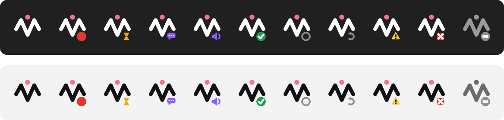

# Usage

Purpose: how to use VoiceMate day to day: the flows, the hotkeys, the companion app, the Whisper models and the voice options. Back to the [README](../README.md).

## Hotkeys

| Default hotkey | Flow | Tray menu action | Result |
|---|---|---|---|
| `Ctrl+Alt+V` | Clipboard (core) | "Dictate" | The transcription goes to the clipboard |
| `Ctrl+Alt+A` | Claude (**experimental**) | "Ask Claude" | The transcription goes to Claude; the answer goes to the clipboard and is read aloud |

Every hotkey is a toggle: press it once to start recording, press it again to stop. While a recording runs, the tray menu actions become "Stop and copy" and "Stop and ask Claude".

**The stop decides the destination.** You can start with one hotkey and stop with the other: the hotkey that stops the recording picks the flow.

Change the hotkeys:
- With the companion on Windows: Settings > **Hotkeys**. Click a shortcut, then press the new keys. Each row shows whether the chord is "Available", "Used by another app", "Used by another action" or "Not allowed". "Restore defaults" brings back the defaults.
- From the command line: `--hotkey` and `--claude-chat-hotkey`, for example `make run ARGS='--hotkey "ctrl+shift+r"'`.
- On Linux the engine owns the hotkeys, so the "Hotkeys" tab shows them read-only ("Set by the engine").

## Clipboard flow

1. Press `Ctrl+Alt+V`. The start cue plays once the microphone is really open: speak after it.
2. Speak naturally.
3. Press `Ctrl+Alt+V` again. The transcribing cue plays.
4. The text is copied to the clipboard and the ready cue plays. Paste it with `Ctrl+V`.

With the companion, the text goes through verified delivery: the app writes the clipboard, reads it back and compares, up to 5 times, then sets it once more after 250 ms so the Windows clipboard history (`Win+V`) keeps it. If another app keeps the clipboard locked, the text goes to **Not copied**.

A recording stops by itself after 10 minutes (`--max-recording-seconds`), with a warning at 80 % of the time; it is then transcribed as usual. **Cancel** in the tray menu or the status window drops the current recording.

## Claude flow (experimental)

This second module turns VoiceMate into a voice conversation with Claude. It is optional and **experimental**.

1. Press `Ctrl+Alt+A`, speak your question, press `Ctrl+Alt+A` again.
2. VoiceMate transcribes and copies the transcription to the clipboard, then sends it to Claude.
3. Claude's answer replaces the clipboard content and is read aloud, sentence by sentence, while it streams.
4. Press `Ctrl+Alt+A` again to ask a follow-up question: the conversation keeps its context while the engine runs (up to 50 turns by default).

Details:
- Because both the transcription and the answer pass through the clipboard, `Win+V` on Windows shows both.
- Any hotkey pressed while Claude answers or while TTS speaks interrupts the answer and starts a new recording. The conversation is kept.
- Claude answers in the language of `--output-lang` (default `pt-BR`), for example `make run ARGS="--output-lang en"`. The companion sets it from "Dictation language:" ([Dictation language](#dictation-language)).
- The default model is `claude-haiku-5-5` with effort `low` and thinking off, for low latency. See [configuration.md](configuration.md#claude-flow-experimental) for the flags.
- Requirements: the Claude Code CLI installed and signed in, and the `claude` extra ([installation.md](installation.md#claude-code-cli-for-the-claude-flow)). Without them the Claude flow is disabled with a warning in the engine log, and the clipboard flow keeps working.

### TTS engines

| Engine | Extra | Notes |
|---|---|---|
| `omnivoice` (used when nothing is saved) | `tts` | Can clone a voice (voice seed modes below). Heavy on the GPU; can crackle on WSL2 |
| `kokoro` | `kokoro` | Light, runs on the CPU in real time, fixed voices (`--tts-kokoro-voice`). Needs `espeak-ng`. `make setup` proposes it (it offers Kokoro or OmniVoice) |
| `voxcpm` | `voxcpm` | VoxCPM2, heavier. Designs a voice from a text description (`--tts-voice`) |
| `none` | | No spoken answer (same as `--no-tts`) |

When no engine was saved by `make setup`, the engine uses `omnivoice`. Choose another one with `--tts-engine`, for example `make run ARGS="--tts-engine kokoro --tts-kokoro-voice pf_dora"`.

### Voice seed modes

`--tts-voice-seed-mode` decides how OmniVoice and VoxCPM2 keep a voice. Kokoro has fixed voices and ignores it.

| Mode | How the voice is chosen | Related flags |
|---|---|---|
| `off` (default) | No reference audio. VoxCPM2 designs the voice from `--tts-voice`; OmniVoice uses its default voice | `--tts-voice` (VoxCPM2) |
| `auto` | The first sentence becomes the reference audio, saved in the seed folder; later sentences clone it, also after a restart | `--tts-voice-seed-cache-dir`, `--tts-reset-seed` |
| `fixed` | Every sentence clones a WAV file you provide | `--tts-voice-seed-path` and `--tts-voice-seed-text` (the exact text of the WAV), both required |

The `auto` references live in `~/.cache/voicemate`: `voice_seed.wav` for VoxCPM2 and `voice_seed_omnivoice.wav` for OmniVoice. `--tts-reset-seed` deletes the VoxCPM2 one; delete the OmniVoice one by hand to get a new voice.

```bash
make run ARGS="--tts-voice-seed-mode auto"
make run ARGS='--tts-voice-seed-mode fixed --tts-voice-seed-path /path/voice.wav --tts-voice-seed-text "Hello, this is my voice."'
make run-reset-voz              # same as ARGS="--tts-reset-seed"
make run-vozes-aleatorias       # same as ARGS="--tts-voice-seed-mode off"
```

## Whisper models

Choose a model with `--model` (default `large-v3-turbo`), or `make run-large` (`large-v3`) and `make run-turbo` (`large-v3-turbo`).

| Model | Speed | Quality |
|---|---|---|
| `tiny` | Very fast | Basic |
| `base` | Fast | Good |
| `small` | Moderate | Very good |
| `medium` | Moderate | Great |
| `large-v2` | Slow | Excellent |
| `large-v3` | Slow | Maximum |
| `large-v3-turbo` (default) | Fast | Excellent |

`large-v3-turbo` is the best balance of speed and quality, also for speech that mixes languages. whisper.cpp (AMD) uses its own `ggml-large-v3-turbo.bin` file, downloaded by `make setup`.

### Dictation language

Whisper gets one pinned language for stable results; foreign terms inside the speech (for example English technical terms in Portuguese) still come out right.

**With the companion:** Settings > **General** > "Dictation language:". The options are:

- "Same as the interface" (the default): the language of the companion (`pt-BR`, `en`, `es`, `ru` or `zh-CN`).
- "Detect automatically": Whisper detects the language of each recording, which is less stable for short recordings. Claude keeps answering in the interface language. With Kokoro, pin a language: the engine then also gives `auto` to the TTS, and Kokoro answers in its American English voice, even for Portuguese or Spanish.
- One language, each named in its own language: "Português", "English", "Español", "Русский", "中文", "Français", "Deutsch", "Italiano" or "日本語". A pinned language also sets the language of Claude's spoken answers.

The companion passes the choice to the engine it starts as `--transcription-language` and `--output-lang`, and changing it restarts the engine. An engine the companion only connects to keeps its own flags: with the mode "Connect only" the setting is disabled, and a systemd unit or an engine you started by hand is attached to, not started, so it follows its own `--transcription-language` and `--output-lang`.

**From the command line:** the engine defaults to Portuguese. `--output-lang` defaults to `pt-BR`, and from it the transcription language is derived (`pt-BR` gives `pt`), so a run without flags pins Whisper to Portuguese and English speech comes out wrong. Pass `--output-lang en` (also the language of Claude's answers and of the engine messages), or pin only the transcription with `--transcription-language {auto,pt,en,es,fr,de,it,ja,ru,zh}`:

```bash
make run ARGS="--output-lang en"
make run ARGS="--transcription-language en"
```

`make run` runs in the shell of the system where the engine runs: bash on Linux and inside WSL, PowerShell or cmd for an engine run natively on Windows. The `ARGS` examples work in all of them.

`VOICEMATE_LANG` changes the language of the engine messages only (`pt-BR`, `en`, `es`, `ru` or `zh-CN`). It wins over `--output-lang` there, and does not change what Whisper hears. Set it in the shell that runs `make run`:

```bash
VOICEMATE_LANG=en make run          # bash: Linux, or inside WSL
```

```powershell
$env:VOICEMATE_LANG="en"; make run  # PowerShell: engine run natively on Windows
```

The companion ignores it.

## Companion app

### Tray icon and menu

The tray icon is the VoiceMate figure; a small badge in its corner shows the state. A left click opens the status window.

<p align="center"></p>

| Badge (left to right) | State | What the menu and tooltip say |
|---|---|---|
| No badge | Idle | "Listening for Ctrl+Alt+V" |
| Red dot | Recording | "Recording 00:12" |
| Hourglass | Transcribing | "Transcribing..." |
| Speech bubble | Thinking (Claude) | "Claude is answering..." |
| Speaker | Speaking (Claude) | "Claude is answering..." |
| Check mark | Ready, for 3 seconds | "Copied: ..." |
| Ring | Starting | "Starting engine..." |
| Circular arrow | Restarting | "Restarting (attempt 2)" |
| Triangle | Warning | "No microphone" or "WSL audio stopped" |
| Cross | Error | "The engine stopped working" |
| Grey octagon, icon dimmed | Stopped | "VoiceMate is stopped" |

The menu has:

- The status line, then "Open VoiceMate".
- "Dictate" and "Ask Claude" with their hotkeys ("Stop and copy" and "Stop and ask Claude" while recording), and "Cancel".
- "Recent": the last transcriptions; click one to copy it again.
- "Not copied ({count})": only when something failed to reach the clipboard; click an item to copy it; "Clear list" empties it after asking 'Clear the "Not copied" list?'.
- "Restart WSL now...": only while a WSL restart waits for your approval.
- "Mute sounds".
- "Engine" > "Restart engine", "Restart WSL..." (WSL mode only), "Open logs".
- "Settings..." and "Quit VoiceMate".

### Status window

The status window shows the status line, "Engine:", "Audio:", "Microphones:" and "Restarts:", the **Not copied** group ("Clear", "Copy"), the **Recent** group ("Copy"), and the buttons "Settings...", "Restart engine", "Open logs" and "Quit VoiceMate". Banners appear when the engine is outdated or when WSL audio stopped. On Linux without a system tray, the status window is the main window.

### Not copied

A transcription that never reached the clipboard is kept in **Not copied** and saved to `pending.json`, so it survives a restart or a crash (at most 50 items). It leaves the list when you copy it or clear the list. The file holds the transcription text; it stays in your user profile, is deleted when the list is empty, and the uninstaller removes it.

### Sounds and notifications

- Settings > **Sounds**: "Play sound cues", a master "Volume:", and one row per cue ("Recording started", "Transcribing", "Copied", "Claude answered", "Warning", "Error") with a "Built-in" sound ("Classic", "Soft", "Click") or a "Custom file" (PCM WAV, 8 or 16 bit), its own volume and "Preview".
- Settings > **General** > "Notifications:": "All", "Warnings and errors" (default), "Errors only" or "None".

### Pinned icon and command line (Windows)

Pin VoiceMate to the taskbar from the Start menu. A click on the pinned icon opens the status window; a right click offers "Settings", "Restart engine", "Restart WSL..." and "Quit VoiceMate".

The executable also forwards commands to the running instance. A command never starts VoiceMate:

```powershell
& "$env:LOCALAPPDATA\Programs\VoiceMate\VoiceMate.exe" --command quit
```

Commands: `show`, `quit`, `restart-engine`, `restart-wsl`, `settings`. From source: `make run-tray ARGS="--command quit"`. `--demo` starts a demo with a fake engine.

### Quitting

"Quit VoiceMate" stops the engine that the companion started. An engine it only attached to (for example the systemd service) keeps running.

## Mouse trigger (Windows only)

On native Windows the clipboard flow can use a mouse side button instead of a hotkey:

```bash
make run ARGS="--input-method mouse --mouse-button x"
```

It needs the `keyboard-hooks` trigger, so it works on Windows only; other platforms fall back to keyboard hotkeys with a warning. The mouse trigger disables the Claude flow.

## Running the engine without the companion

| Command | Runs |
|---|---|
| `make run` | `voice-mate` with your `ARGS` and the engine's own hotkeys |
| `make run-engine` | `voice-mate --supervised --api --api-token`: the engine as the companion starts it |
| `make run-large`, `make run-turbo` | `--model large-v3`, `--model large-v3-turbo` |

On WSL2 the engine has no global hotkeys of its own (Windows hotkeys do not reach WSL): its trigger is the HTTP API, driven by the companion. The older PowerShell and AutoHotkey scripts in `scripts/windows/` still work with `make run` (no token), but the companion replaces them.
